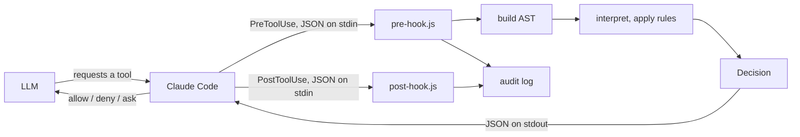
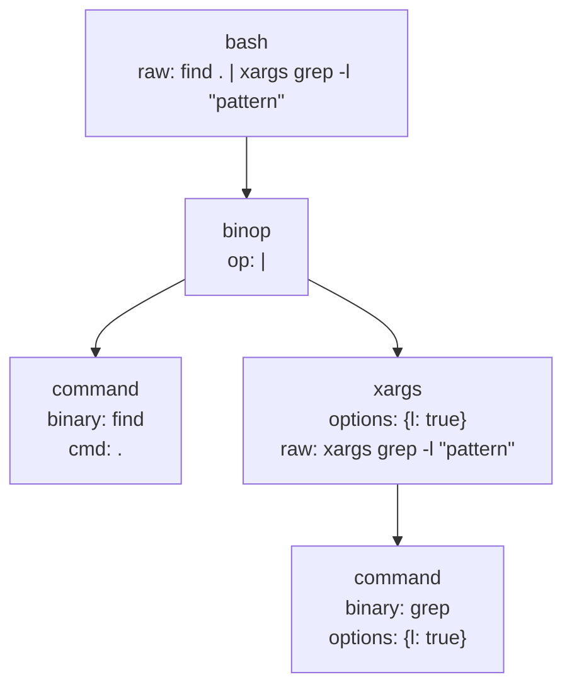
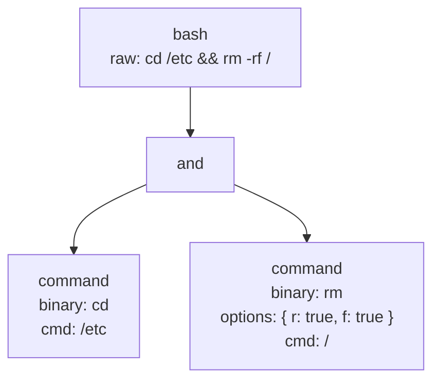
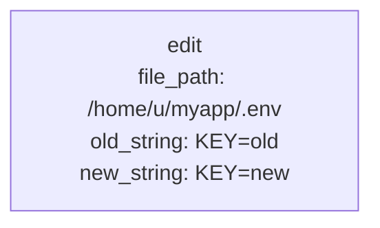
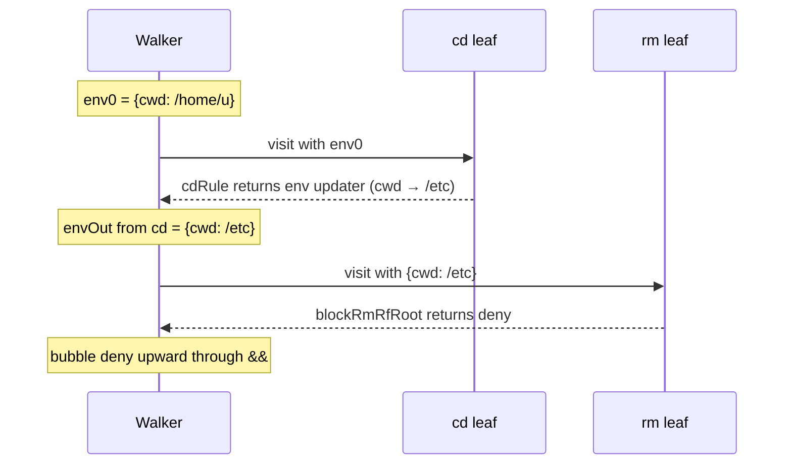
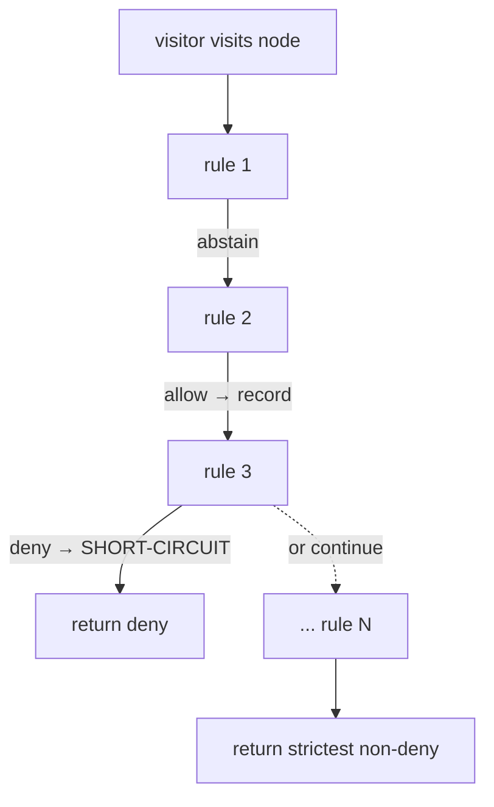

# How it works

Architecture deep-dive for someone who wants to write non-trivial rules or debug an unexpected decision.

---

- [1. End-to-end flow](#1-end-to-end-flow)
- [2. Tool call → AST](#2-tool-call--ast)
- [3. Walking the AST with an Environment](#3-walking-the-ast-with-an-environment)
- [4. Per-node rule evaluation](#4-per-node-rule-evaluation)
- [5. Bubble-up at intermediate nodes](#5-bubble-up-at-intermediate-nodes)
- [6. Built-in rules](#6-built-in-rules)
- [7. User extensibility](#7-user-extensibility)
- [8. Audit log](#8-audit-log)
- [9. Shared analysis core](#9-shared-analysis-core-srcanalyzets)
- [10. Permission REPL](#10-permission-repl-srcreplts)
- [11. Permission Analyzer MCP server](#11-permission-analyzer-mcp-server-srcmcp-serverts)

---

## 1. End-to-end flow



- **Claude Code** intercepts every tool call via the `PreToolUse` hook and writes a JSON payload to `pre-hook.js` on stdin.
- **`pre-hook.js`** (`src/pre-hook.ts`) reads stdin, calls `decide(call)`, and writes the result JSON to stdout. It is intentionally thin - no logic lives here.
- **build AST** (`src/build-ast.ts`) converts the raw `ToolCall` into a typed root AST node (`bash`, `read`, `write`, `edit`, `multiedit`, or the generic `other` fallback). For Bash, it delegates sub-tree construction to `parseBash`.
- **interpret, apply rules** (`src/interpret.ts`) walks the tree with an immutable `Environment`, runs every registered rule at each node, and aggregates outcomes bottom-up. Each non-abstaining rule match and aggregation step is written to the audit log.
- **`Decision`** (`allow` / `deny` / `ask`) flows back to Claude Code, which acts on it.
- **`post-hook.js`** (`src/post-hook.ts`) fires via the `PostToolUse` hook after the tool actually executes (only for allowed calls). It records the tool result and any error flag to the audit log.

## 2. Tool call → AST

`buildAst` switches on `tool_name` and lifts the relevant fields into a typed node. For Bash, it first loads **command descriptor files** via `loadCommandDescriptors(projectDir)` from `~/.claude/permissions.d/commands/` (home) and `.claude/permissions.d/commands/` (project, wins on conflict). The resulting `Map<string, ICommandDescriptor>` is threaded into `parseBash`, which uses it to determine flag arity (whether a flag consumes the next token as its value) and positional kinds (path vs. string). Without a descriptor for a command, all flags default to arity 0.

`parseBash` runs a hand-written recursive descent parser: a flat lexer produces a token stream, then grammar functions (`parseSequence` / `parseAnd` / `parseOr` / `parsePipe` / `parseCommand`) call each other recursively to build a left-associative sub-AST of `Command` leaves connected by `BinOp` nodes (`pipe`, `and`, `or`, `seq`). After parsing, `buildAst` applies `transformXargsNodes` to the sub-tree: every `Command` leaf with `binary: "xargs"` is replaced by an `IXargsNode` intermediate node whose `child` is the parsed subcommand.

For `find . | xargs grep -l "pattern"`:



For `cd /etc && rm -rf /`:



For an `Edit` tool call - there is no Bash sub-tree; the AST is a single typed leaf:



Source files: [`src/parse-bash.ts`](https://github.com/ashleydavis/expressive-permissions/blob/main/src/parse-bash.ts), [`src/build-ast.ts`](https://github.com/ashleydavis/expressive-permissions/blob/main/src/build-ast.ts).

## 3. Walking the AST with an Environment

The interpreter threads an immutable `Environment` (`{ cwd, cwdResolved, env }`) down through nodes. At each node it calls a visitor (which runs the rules), collects the visitor's env update, then recurses into children with the updated env. Env is always cloned - never mutated.

Sequence diagram for `cd /etc && rm -rf /` (starting cwd `/home/u`):



### Operator env semantics

| Operator | Left sees | Right sees | Env returned to parent |
|---|---|---|---|
| `seq` (`;`) | parent env | env after walking left | env after walking right |
| `and` (`&&`) | parent env | env after walking left | env after walking right |
| `or` (`\|\|`) | parent env | parent env (LHS may not have run) | parent env (conservative) |
| `pipe` (`\|`) | parent env | parent env (each side is a subshell) | parent env |

`or` and `pipe` discard subtree env changes; `seq` and `and` propagate left→right→up.

## 4. Per-node rule evaluation

At each node the visitor runs all registered rules in order. The flowchart below shows one node's evaluation:



Per-rule actions in detail:

1. **deny** - immediately short-circuits; no later rules run. The deny decision and the rule name are recorded.
2. **ask** - recorded and protected. Later `allow` rules cannot downgrade it.
3. **allow** - recorded only if nothing stricter (`ask` or `deny`) has been seen yet. Ties (same rank) go to the latest rule, so the explanation cites the most recently matched rule.
4. **abstain** - skipped entirely; does not affect the running annotation.
5. If no rule produced a concrete decision, the visitor returns `abstain`.

Rank order for strictest-wins: `abstain (0) < allow (1) < ask (2) < deny (3)`.

### `runningEnv` - cross-rule env visibility

Rules at the same node share a `runningEnv`. Each rule that returns a `scopedEnv` or persistent `env` update mutates `runningEnv` for subsequent rules at *this node*. This lets `envPrefixRule` install `FOO=bar` into `runningEnv` so that a later permission rule at the same leaf can read `env.env.FOO`. Persistent `env` updates also propagate to siblings; `scopedEnv` updates do not.

## 5. Bubble-up at intermediate nodes

After visiting an intermediate node itself, the interpreter aggregates child outcomes and layers the visitor's result on top.

**Phase 1 — aggregate children:**

| Condition | Result |
|---|---|
| Any child is `deny` | `deny` |
| All children are `allow` | `allow` |
| Otherwise | `ask` |

**Phase 2 — layer the visitor's own decision on top:**

| Visitor decision | Result |
|---|---|
| `deny` | `deny` (overrides everything) |
| `ask` | `ask` (overrides all-allow children) |
| `allow` | `allow` (overrides ask from children) |
| `abstain` | Keep Phase 1 result |

Worked examples:

| Command | What happens | Result |
|---|---|---|
| `cd /etc && rm -rf /` | `rm` leaf → deny; bubbles through `&&` | **deny** |
| `git status` | single leaf → allow (via `allowGitReadOnly`); propagates through bash root | **allow** |
| `git status \| wc -l` | children = [allow, ask]; not all-allow → ask | **ask** |
| `git status && git diff` | both children → allow; all-allow | **allow** |
| `npm test && rm -rf /` | `rm` leaf → deny; wins over allow from npm | **deny** |

## 6. Built-in rules

These rules handle Bash semantics. They always `abstain` on the decision and only update `env` as a side effect, so they never block a call on their own.

| Rule | File | Matches | Env effect |
|---|---|---|---|
| `cdRule` | `src/rules/builtin/cd.ts` | `cd <path>` | Updates `env.cwd` persistently via `&&` / `;` propagation |
| `envPrefixRule` | `src/rules/builtin/env-prefix.ts` | `FOO=bar cmd` (non-empty binary + envPrefix) | Installs prefix vars into `env.env` for this command only (`scopedEnv` - transient) |
| `envSetRule` | `src/rules/builtin/env-set.ts` | `FOO=bar` with no binary | Updates `env.env` persistently |
| `exportRule` | `src/rules/builtin/export.ts` | `export FOO=bar [BAZ=qux …]` | Updates `env.env` persistently |
| `xargsRule` | `src/rules/builtin/xargs.ts` | `IXargsNode` (any xargs command) | None -- always abstains; child decision propagates |

Built-ins are registered first in `src/rules/index.ts` so their env updates land in `runningEnv` before permission rules read them - e.g. `NODE_ENV=production npm start` makes `NODE_ENV` visible to a permission rule that wants to deny production runs.

## 7. User extensibility

### TypeScript rules

A rule is a single function `(node: AstNode, env: Environment, call: ToolCall) => RuleOutcome`. Place it in its own file under `src/rules/`, add it to the array in `src/rules/index.ts`, write a paired test under `src/test/rules/`, then rebuild (`bun run bundle`).

Rules should:
- Return `ABSTAIN` for node types they don't care about (by `node.type`).
- Read `node.options`, `node.binary`, `node.file_path`, etc. - whichever fields match the node type.
- Read `env.cwd` / `env.cwdResolved` / `env.env` when the decision depends on where the call runs.
- Return a persistent `env` update (not a decision) for side effects like tracking cwd changes.

### YAML rules

Drop a `.claude/permissions.yaml` in your project root (or `~/.claude/permissions.yaml` for user-global rules). You can also split rules across multiple files under `.claude/permissions.d/*.yaml` (and the home equivalent) — each drop-in file becomes its own isolated layer. YAML rules are compiled to `Rule` functions at startup and appended to the registry after the semantic built-ins. No rebuild required - just `/reload-plugins`.

See [CONFIGURATION.md](CONFIGURATION.md) for the full conditions table and glob semantics.

### Registry ordering and conflict resolution

Rules are evaluated through a layered delegation chain:

```
Hook (interpret.ts) → RuleRegistry → RuleLayer | FileLayer → Rule
```

The layers in evaluation order:

1. **Built-in layer** (`RuleLayer`) — cd, env-prefix, env-set, export. Static; never reloads. Runs first so env state is correct when YAML rules evaluate it.
2. **Home main layer** (`FileLayer`) — compiled from `~/.claude/permissions.yaml` once at hook startup. Returns `[]` when `HOME` is unset or the file is absent.
3. **Home drop-in layers** (one `FileLayer` per file) — every `~/.claude/permissions.d/*.yaml` or `.yml`, sorted alphabetically. Each file is its own isolated layer.
4. **Project main layer** (`FileLayer`) — compiled from `.claude/permissions.yaml` (relative to `CLAUDE_PROJECT_DIR`) once at hook startup. Returns `[]` when `CLAUDE_PROJECT_DIR` is unset or the file is absent.
5. **Project drop-in layers** (one `FileLayer` per file) — every `.claude/permissions.d/*.yaml` or `.yml` under `CLAUDE_PROJECT_DIR`, sorted alphabetically.

All YAML config files are compiled independently — none overrides another. All rules from all files are evaluated. `RuleRegistry.runRules` iterates the layers in order, threads the persistent env from each layer's result into the next, and applies strictest-wins across layers. A deny in any layer short-circuits the remaining layers, so a `permissions.d/aws.yaml` deny wins over an allow in a sibling drop-in or the project main file evaluated later.

The plugin ships with no default YAML rules. All permission decisions come from the user's config files. Within each layer, strictest-wins applies: a deny short-circuits later rules, and an ask cannot be downgraded by a later allow at the same node.

## 8. Audit log

Every hook invocation writes structured entries to `.claude/permissions-log/` inside the project root (`CLAUDE_PROJECT_DIR`). Files are partitioned by hour in local time:

```
.claude/permissions-log/
└── YYYY-MM/
    └── DD/
        ├── HH.json   # JSON Lines — one entry per line, machine-readable
        └── HH.log    # plain text — human-readable summary
```

### Entry types

| Type | Written by | When |
|---|---|---|
| `tool_request` | `pre-hook.js` | Once per invocation, before any rule runs — captures the raw tool call |
| `rule_match` | `pre-hook.js` | Once per non-abstaining rule at any AST node — records rule name, decision, and matched cmd |
| `aggregation` | `pre-hook.js` | Once per intermediate node — records children decision, own decision, and combined result |
| `final_decision` | `pre-hook.js` | Once per invocation, just before returning — the authoritative allow / deny / ask |
| `tool_execution` | `post-hook.js` | Once per allowed tool execution — captures the tool response and whether it reported an error |

### Retention

The three most recent calendar months are kept. Months older than that are pruned automatically on each hook invocation. Files within a kept month are never deleted.

## 9. Shared analysis core (`src/analyze.ts`)

Both the REPL and the MCP server use the same `analyzePermission` function from `src/analyze.ts` rather than calling `decide()` directly. This guarantees they produce identical results to the live hook.

`analyzePermission(input, cwd, projectDir)` does three things:

1. **Parse input** -- `parseToolCallInput` converts a user string into a `ToolCall`. A bare string becomes a Bash call. Prefixed strings (`read <path>`, `write <path>`, `edit <path>`, `webfetch <url>`, `tool <name>`) become the corresponding typed tool call.
2. **Build registry** -- `buildAnalysisRegistry` constructs the same three-layer `RuleRegistry` the live hook uses (built-ins → home config → project config), temporarily setting `CLAUDE_PROJECT_DIR` so the file loaders resolve paths correctly.
3. **Run and capture** -- `decide()` is called with a `CapturingAuditLogger` that records every rule match, aggregation, and final decision. The logger's entries become the `trace` array in the returned `IAnalysisResult`.

## 10. Permission REPL (`src/repl.ts`)

The REPL is a thin shell around `analyzePermission`. It has two modes:

- **Interactive** -- reads lines from stdin, calls `analyzePermission` for each, and prints the trace and final verdict in ANSI colour. The `:cwd <path>` command changes the working directory for subsequent evaluations; `:project <path>` (alias `:proj <path>`) changes both the project dir (used to expand `${{PROJECT_DIR}}`) and the cwd together; `:quit` or Ctrl-D exits.
- **One-shot** -- when a command is passed as `process.argv[2]`, the REPL calls `analyzePermission` once, prints the result, and exits with code 0 (allow), 1 (deny), or 2 (ask). This is what `scripts/repl-smoke-tests.sh` uses.

Neither mode touches the live hook or writes to the audit log. The `CapturingAuditLogger` inside `analyzePermission` captures all trace entries in memory and they are discarded after printing.

## 11. Permission Analyzer MCP server (`src/mcp-server.ts`)

The MCP server exposes a single tool, `analyze_permission`, over stdio using the `@modelcontextprotocol/sdk` `StdioServerTransport`. Claude Code registers it via `.mcp.json` and calls it automatically when you ask permission questions in natural language.

When `analyze_permission` is called:

1. `analyzePermission(command, cwd, projectDir)` is called with the arguments from the tool input (defaulting `cwd` and `projectDir` to `CLAUDE_PROJECT_DIR` or `process.cwd()`).
2. The result is formatted as a text block: decision, reason, and a filtered trace. `config_load` and `tool_request` entries are stripped because they appear on every call and do not help explain why a rule matched.
3. The text block is returned as the tool response. Claude reads it and explains the result in natural language.

The server is bundled into `plugin/dist/mcp-server.js` for distribution. Plugin users get it automatically via `plugin/.mcp.json`; repository developers use the repo-root `.mcp.json` which points at the TypeScript source directly.
