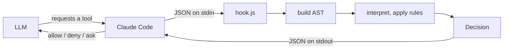
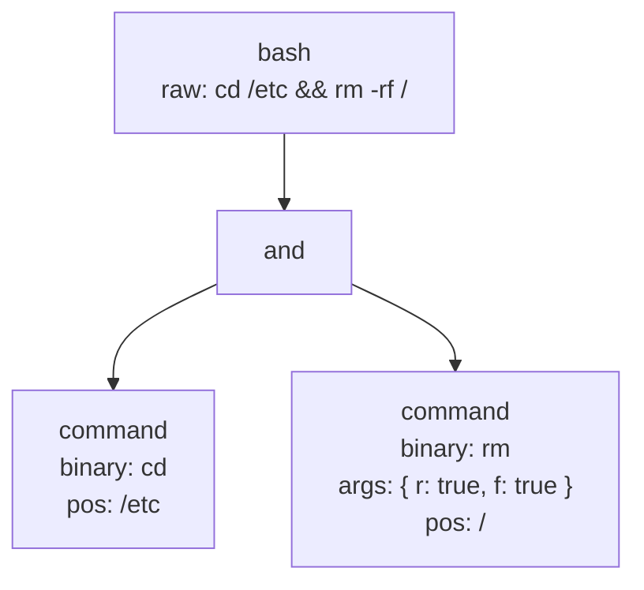
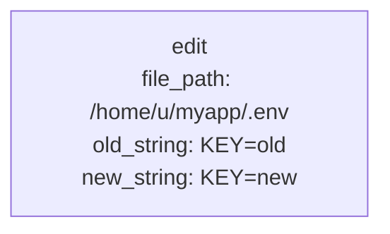
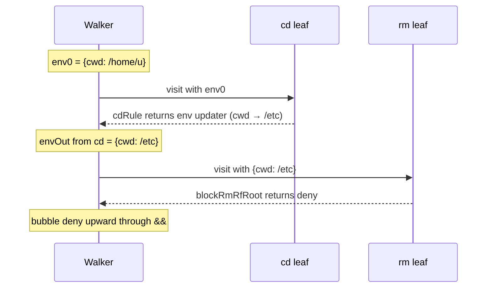
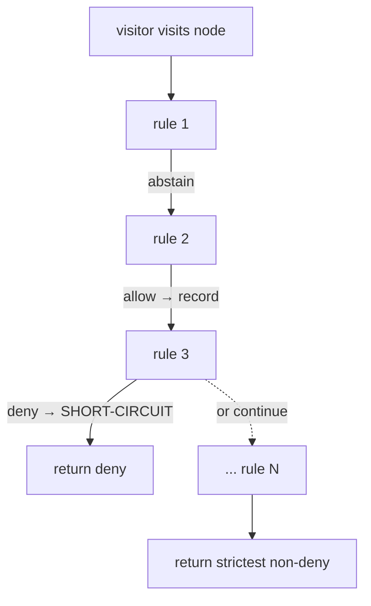

# How it works

Architecture deep-dive for someone who wants to write non-trivial rules or debug an unexpected decision.

## 1. End-to-end flow

- **Claude Code** intercepts every tool call via the `PreToolUse` hook and writes a JSON payload to `hook.js` on stdin.
- **`hook.js`** (`src/hook.ts`) reads stdin, calls `decide(call)`, and writes the result JSON to stdout. It is intentionally thin - no logic lives here.
- **build AST** (`src/build-ast.ts`) converts the raw `ToolCall` into a typed root AST node (`bash`, `read`, `write`, `edit`, `multiedit`, or the generic `other` fallback). For Bash, it delegates sub-tree construction to `parseBash`.
- **interpret, apply rules** (`src/interpret.ts`) walks the tree with an immutable `Environment`, runs every registered rule at each node, and aggregates outcomes bottom-up.
- **`Decision`** (`allow` / `deny` / `ask`) flows back to Claude Code, which acts on it.

## 2. Tool call → AST

`buildAst` switches on `tool_name` and lifts the relevant fields into a typed node. For Bash, `parseBash` runs a hand-written recursive descent parser: a flat lexer produces a token stream, then grammar functions (`parseSequence` / `parseAnd` / `parseOr` / `parsePipe` / `parseCommand`) call each other recursively to build a left-associative sub-AST of `Command` leaves connected by `BinOp` nodes (`pipe`, `and`, `or`, `seq`).

For `cd /etc && rm -rf /`:

For an `Edit` tool call - there is no Bash sub-tree; the AST is a single typed leaf:

Source files: [`src/parse-bash.ts`](../src/parse-bash.ts), [`src/build-ast.ts`](../src/build-ast.ts).

## 3. Walking the AST with an Environment

The interpreter threads an immutable `Environment` (`{ cwd, cwdResolved, env }`) down through nodes. At each node it calls a visitor (which runs the rules), collects the visitor's env update, then recurses into children with the updated env. Env is always cloned - never mutated.

Sequence diagram for `cd /etc && rm -rf /` (starting cwd `/home/u`):

### Operator env semantics

| Operator | Left sees | Right sees | Env returned to parent |
|---|---|---|---|
| `seq` (`;`) | parent env | env after walking left | env after walking right |
| `and` (`&&`) | parent env | env after walking left | env after walking right |
| `or` (`\|\|`) | parent env | parent env (LHS may not have run) | parent env (conservative) |
| `pipe` (`\|`) | parent env | parent env (each side is a subshell) | parent env |

`or` and `pipe` discard subtree env changes; `seq` and `and` propagate left→right→up.

## 4. Per-node rule evaluation

At each node the visitor runs all registered rules in order. The flowchart below shows one node's evaluation:

Per-rule actions in detail:

1. **deny** - immediately short-circuits; no later rules run. The deny decision and the rule name are recorded.
2. **ask** - recorded and protected. Later `allow` rules cannot downgrade it.
3. **allow** - recorded only if nothing stricter (`ask` or `deny`) has been seen yet. Ties (same rank) go to the latest rule, so the explanation cites the most recently matched rule.
4. **abstain** - skipped entirely; does not affect the running annotation.
5. If no rule produced a concrete decision, the visitor returns `abstain`.

Rank order for strictest-wins: `abstain (0) < allow (1) < ask (2) < deny (3)`.

### `runningEnv` - cross-rule env visibility

Rules at the same node share a `runningEnv`. Each rule that returns a `scopedEnv` or persistent `env` update mutates `runningEnv` for subsequent rules at *this node*. This lets `envPrefixRule` install `FOO=bar` into `runningEnv` so that a later permission rule at the same leaf can read `env.env.FOO`. Persistent `env` updates also propagate to siblings; `scopedEnv` updates do not.

## 5. Bubble-up at intermediate nodes

After visiting an intermediate node itself, the interpreter aggregates child outcomes and layers the visitor's result on top.

**Phase 1 — aggregate children:**

| Condition | Result |
|---|---|
| Any child is `deny` | `deny` |
| All children are `allow` | `allow` |
| Otherwise | `ask` |

**Phase 2 — layer the visitor's own decision on top:**

| Visitor decision | Result |
|---|---|
| `deny` | `deny` (overrides everything) |
| `ask` | `ask` (overrides all-allow children) |
| `allow` | `allow` (overrides ask from children) |
| `abstain` | Keep Phase 1 result |

Worked examples:

| Command | What happens | Result |
|---|---|---|
| `cd /etc && rm -rf /` | `rm` leaf → deny; bubbles through `&&` | **deny** |
| `git status` | single leaf → allow (via `allowGitReadOnly`); propagates through bash root | **allow** |
| `git status \| wc -l` | children = [allow, ask]; not all-allow → ask | **ask** |
| `git status && git diff` | both children → allow; all-allow | **allow** |
| `npm test && rm -rf /` | `rm` leaf → deny; wins over allow from npm | **deny** |

## 6. Built-in rules

These rules handle Bash semantics. They always `abstain` on the decision and only update `env` as a side effect, so they never block a call on their own.

| Rule | File | Matches | Env effect |
|---|---|---|---|
| `cdRule` | `src/rules/builtin/cd.ts` | `cd <path>` | Updates `env.cwd` persistently via `&&` / `;` propagation |
| `envPrefixRule` | `src/rules/builtin/env-prefix.ts` | `FOO=bar cmd` (non-empty binary + envPrefix) | Installs prefix vars into `env.env` for this command only (`scopedEnv` - transient) |
| `envSetRule` | `src/rules/builtin/env-set.ts` | `FOO=bar` with no binary | Updates `env.env` persistently |
| `exportRule` | `src/rules/builtin/export.ts` | `export FOO=bar [BAZ=qux …]` | Updates `env.env` persistently |

Built-ins are registered first in `src/rules/index.ts` so their env updates land in `runningEnv` before permission rules read them - e.g. `NODE_ENV=production npm start` makes `NODE_ENV` visible to a permission rule that wants to deny production runs.

## 7. User extensibility

### TypeScript rules

A rule is a single function `(node: AstNode, env: Environment, call: ToolCall) => RuleOutcome`. Place it in its own file under `src/rules/`, add it to the array in `src/rules/index.ts`, write a paired test under `src/test/rules/`, then rebuild (`bun bundle`).

Rules should:
- Return `ABSTAIN` for node types they don't care about (by `node.type`).
- Read `node.args`, `node.binary`, `node.file_path`, etc. - whichever fields match the node type.
- Read `env.cwd` / `env.cwdResolved` / `env.env` when the decision depends on where the call runs.
- Return a persistent `env` update (not a decision) for side effects like tracking cwd changes.

### YAML rules

Drop a `.claude/permissions.yaml` in your project root (or `~/.claude/permissions.yaml` for user-global rules). YAML rules are compiled to `Rule` functions at startup and appended to the registry after the semantic built-ins. No rebuild required - just `/reload-plugins`.

See [USER-DEFINED-RULES.md](USER-DEFINED-RULES.md) for the full conditions table and glob semantics.

### Registry ordering and conflict resolution

Rules run in registry order. The ordering in `src/rules/index.ts`:

1. Built-in semantic rules (cd, env-prefix, env-set, export) - listed first so env updates are ready before permission rules run.
2. YAML rules - appended via `...loadConfigRules()`, which merges `~/.claude/permissions.yaml` (home) and `.claude/permissions.yaml` (project), with project beating home on conflict at the top-level key.

The plugin ships with no default rules. All permission decisions come from the user's YAML config. Within the compiled rule list, strictest-wins applies: a deny short-circuits any later rules, and an ask cannot be downgraded by a later allow at the same node.
