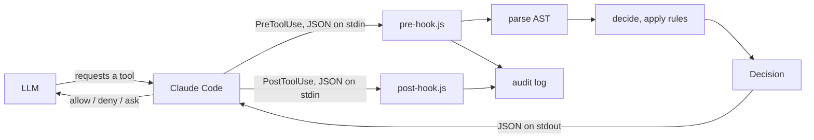
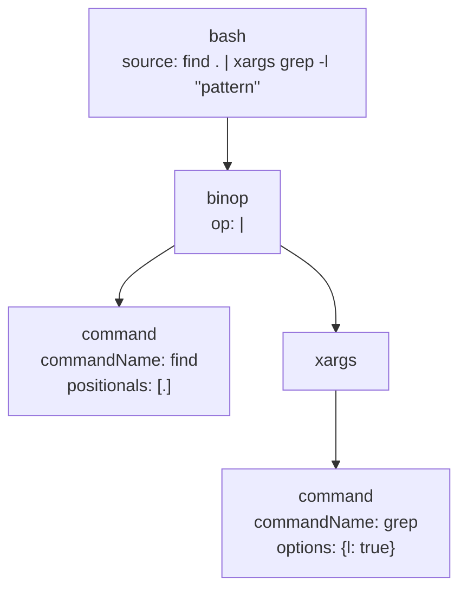
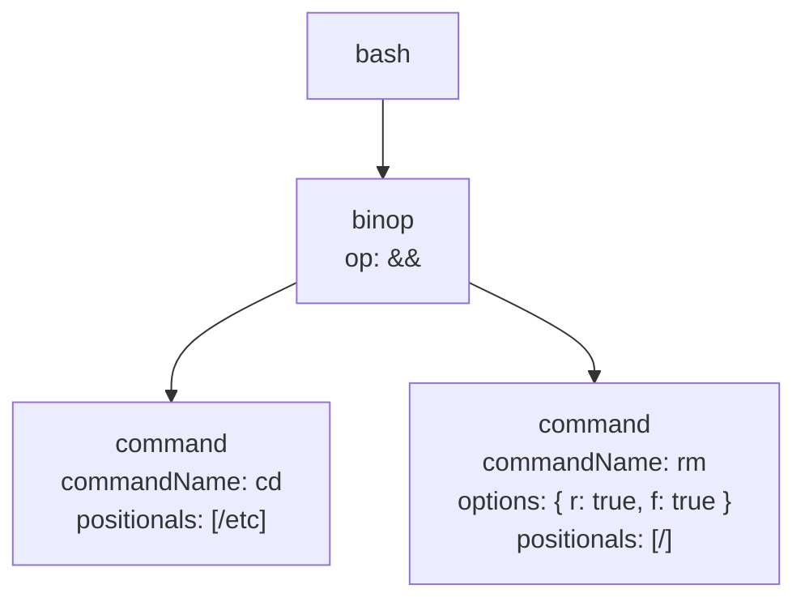

# How it works

This doc explains the permission engine architecture: AST parsing, rule evaluation, and context threading.


- [End-to-end flow](#end-to-end-flow)
- [Tool call → AST](#tool-call--ast)
- [Walking the AST with a Context](#walking-the-ast-with-a-context)
- [Per-node rule evaluation](#per-node-rule-evaluation)
- [Bubble-up at intermediate nodes](#bubble-up-at-intermediate-nodes)
- [Built-in rules](#built-in-rules)


## End-to-end flow



- **Claude Code** intercepts every tool call via the `PreToolUse` hook and passes a JSON payload to the hook on stdin.
- [**Pre-hook**](../src/pre-hook.ts) reads stdin, parses the tool call into an AST via `parseToolCallToAst`, loads rules with `load`, calls `decide`, emits audit entries, and writes the hook result JSON to stdout. On `ask`, it also writes a pending approval file.
- [**Parse**](../src/parse.ts) parses the tool call and commands into an AST.
- [**Decide**](../src/decision.ts) evaluates the AST which returns a flat rule list with an immutable context.
- **`Decision`** (`allow` / `deny` / `ask`) flows back to Claude Code. No matching rule defaults to `ask`.
- [**Post-hook**](../src/post-hook.ts) fires via `PostToolUse` after an allowed tool executes, and records the result to the audit log (and clears pending approval files).

## Tool call → AST

[`parse`](../src/parse.ts) dispatches on `tool_name` and builds a typed AST for each supported tool (Bash, Read, Write, Edit, Grep, WebFetch, Agent, and a fallback for everything else).

Bash and Shell commands are tokenized and parsed into `command`, `binop`, `redirect`, `substitution`, `xargs`, and block nodes. [`parseToolCallToAst`](../src/analyze.ts) loads **command descriptors** from home and project `permissions.d/commands/` (project wins on conflict) so the parser knows flag arity and positional kinds before it runs.

### How redirects appear in the AST

Each shell redirect is a `redirect` node wrapping the inner command. Multiple redirects nest outward; the innermost redirect sits closest to the `command` node.

```
redirect  op: >
├── command
│   └── echo foo
└── target: bar.txt
```

```
redirect  op: 2>&
├── redirect  op: >
│   ├── command
│   │   └── cmd
│   └── target: out.log
└── target: 1
```

Permission decisions on the inner `command` node, each `redirect` node, and parent compounds aggregate via strictest-wins as the walker moves up the tree. A `redirect.out` rule fires on the `redirect` node; a `bash.echo` rule fires on the inner `command` node inside the wrapper. YAML for those rules is in [CONFIGURATION.md](CONFIGURATION.md#redirect-path-rules).

Block constructs include `for_loop`, `while_loop`, `if_statement`, `case_statement`, and `group` (subshell or brace).

Command nodes expose:

| Field | Meaning |
|---|---|
| `commandName` | argv[0] (e.g. `ls`, `rm`) |
| `options` | Flag map (boolean or string values) |
| `positionals` | Non-flag arguments |
| `envPrefix` | `KEY=value` assignments before the command name |

YAML matchers still use `cmd` / `cmd-in` for positionals; those names are rule fields, not AST field names.

Worked examples live under [`examples/ast/`](../examples/ast). Decision examples live under [`examples/decision/`](../examples/decision). Smoke tests run both.

For `find . | xargs grep -l "pattern"`:



For `cd /etc && rm -rf /`:



Source files: [`src/parse.ts`](https://github.com/ashleydavis/expressive-permissions/blob/main/src/parse.ts), [`src/analyze.ts`](https://github.com/ashleydavis/expressive-permissions/blob/main/src/analyze.ts).

## Walking the AST with context

The checker walks the tree tracking working directory and environment. Children run in order, so a `cd` or env assignment on one command affects checks on later commands in the same list. Rules on a node run after its children.

`for` loops and subshells keep local changes inside the loop or `( ... )` block.

Both sides of `&&`, `||`, and `|` are checked even when a real shell might skip one, so every command that could run gets a permission decision.

## Per-node rule evaluation

At each node, rules run in load order (built-ins, then home config, then project config). For each rule:

1. **`decision` present**: recorded; on `deny`, later rules at this node are skipped.
2. **no `decision`**: abstain; may still update `context` (e.g. `cd`).

Strictest-wins rank: `abstain (0) < allow (1) < ask (2) < deny (3)`.

Reasons from every rule that produced the winning action are joined with `"; "`.

Inline env prefixes (`FOO=bar cmd`) are visible to bash rule matchers via `commandNode.envPrefix` even when they are not yet merged into `context.env`. Standalone `FOO=bar` is allowed by `EmptyCommandRule` and merged into `context.env` for later commands.

## Bubble-up at intermediate nodes

After children and own rules run:

| Situation | Result |
|---|---|
| Any child is `deny` | That child `deny` (own rules cannot override) |
| Otherwise | `pickStrictest(ownDecisions)` if any own decision, else strictest child decision |
| Node with no decisions | `ask` |

Worked examples:

| Command | What happens | Result |
|---|---|---|
| `cd /etc && rm -rf /` (with an `rm -rf` deny rule) | `rm` → deny; bubbles through `&&` | **deny** |
| `git status \| wc -l` (status allow, wc unmatched) | children = [allow, ask]; strictest is ask | **ask** |
| `git status && git diff` (both allow) | both children → allow | **allow** |

## Built-in rules

Built-ins live under `src/rules/builtin/` and are prepended by `load` before any YAML rules.

| Rule | File | Matches | Decision | Context effect |
|---|---|---|---|---|
| `CdRule` | `cd-rule.ts` | `cd <path>` | abstain | Updates `cwd` (or sets `cwdResolved: false` when the target contains `$`) |
| `EmptyCommandRule` | `empty-command-rule.ts` | empty `commandName` with a non-empty `envPrefix` | allow | Merges `envPrefix` into `context.env` |
| `ExportRule` | `export-rule.ts` | `export KEY=VALUE …` | allow | Merges assignments into `context.env` |

There is no separate env-prefix built-in for `FOO=bar cmd`: matchers read `envPrefix` on the command node. There is no separate `xargs` permission built-in; `xargs` is an AST node whose child is evaluated normally.
