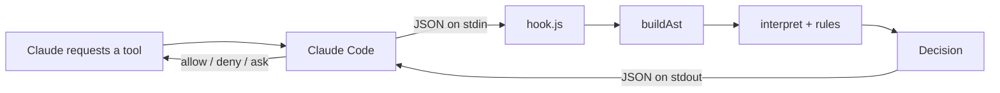
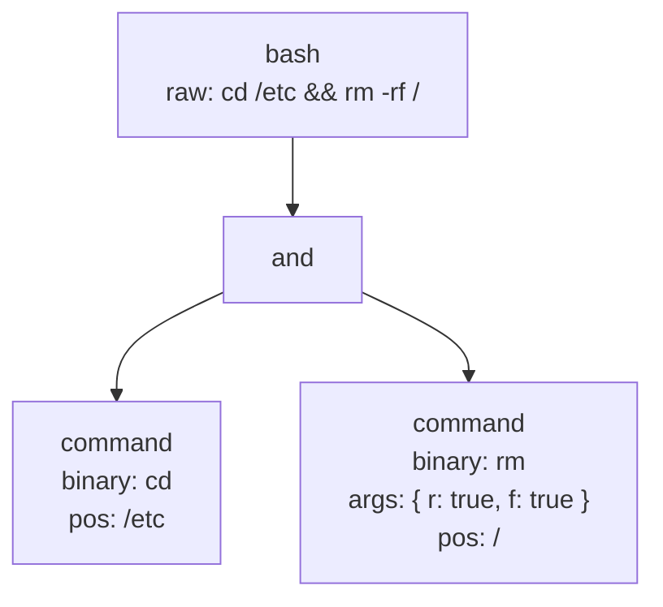
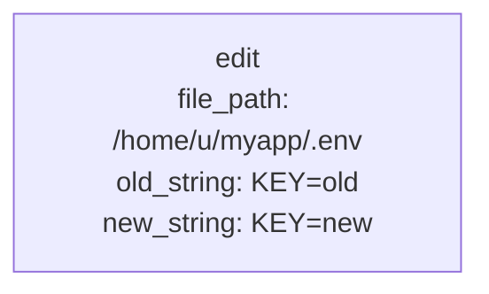
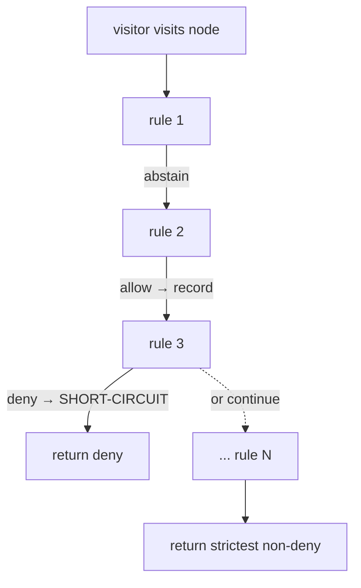

# Plan: Claude Code plugin for managed permissions

## Implementation Steps

- [x] 0. Documentation - `managed-permissions-plugin/0-documentation.md`
- [x] 1. Project scaffolding - `managed-permissions-plugin/1-project-scaffolding.md`
- [x] 2. Core types - `managed-permissions-plugin/2-core-types.md`
- [x] 3. Bash parser - `managed-permissions-plugin/3-bash-parser.md`
- [x] 4. AST builder - `managed-permissions-plugin/4-ast-builder.md`
- [x] 5. Tree interpreter - `managed-permissions-plugin/5-tree-interpreter.md`
- [x] 6. Test helpers and built-in rules - `managed-permissions-plugin/6-test-helpers-and-builtin-rules.md`
- [x] 7. Built-in permission rules - `managed-permissions-plugin/7-built-in-permission-rules.md`
- [x] 8. YAML config loader - `managed-permissions-plugin/8-yaml-config-loader.md`
- [x] 9. Rule registry and orchestrator - `managed-permissions-plugin/9-registry-and-orchestrator.md`
- [x] 10. Runner and integration test - `managed-permissions-plugin/10-runner-and-integration-test.md`
- [x] 11. Plugin manifests and distribution - `managed-permissions-plugin/11-plugin-manifests-and-distribution.md`
- [x] 12. Update documentation - `managed-permissions-plugin/12-update-documentation.md`

## Issues

### Missing / Unspecified

- [x] 1. **`test-helpers.ts` absent from "Files to create"** - added `### src/rules/test-helpers.ts` section to the file inventory with full exported API: `makeArgs`, `makeCommand`, `makeEnv`, and `dummyCall`.

- [x] 2. **`load-config.test.ts` absent from "Files to create"** - added `src/test/load-config.test.ts` to the YAML Tests subsection, including the missing `CLAUDE_PROJECT_DIR` absent, `HOME` absent, and file-not-found cases.

- [x] 3. **`parseBash` return type for empty / whitespace-only input unspecified** - fixed: `parseBash("")` and `parseBash("   ")` now specified to return a `Command` with `binary: ""`, empty `args`/`envPrefix`/`redirects`, and `raw: ""`. Rules handle this via `binary === ""` checks; the decision defaults to `ask`.

- [x] 4. **`CLAUDE_PROJECT_DIR` env var availability unverified** - fixed: added a note in the User configuration section that `CLAUDE_PROJECT_DIR` is not officially documented as set by Claude Code; `load-config.ts` must treat it as potentially absent and silently skip the project YAML when it is.

- [x] 5. **Hook subprocess timeout not addressed** - fixed: added a 5-second `setTimeout` abort at the top of the `hook.ts` IIFE with `.unref()` so it doesn't extend the process lifetime when `decide()` returns normally.

- [x] 6. **`plugin/` subdirectory layout for distribution not reflected in dev layout** - fixed: updated the file tree to show `plugin/` as the distribution subtree and added a callout note explaining the dev vs publish layout distinction.

### Inconsistencies

- [x] 7. **`parseBash` called with two arguments but declared with one** - fixed: `build-ast.ts` now calls `parseBash(command)` (no `cwd` second arg), consistent with `parse-bash.ts` exporting `parseBash(raw: string): BashAstNode`.

- [x] 8. **`Bash` interface missing `cwd` field that `buildAst` adds** - fixed: `buildAst.ts` no longer sets `cwd` on the bash root object; `cwd` is already on the initial `Environment` passed by `decide` and does not need to be duplicated on the node.

- [x] 9. **`mri` appears in the bundled-output description but not in the deps list** - fixed: removed `mri` from the esbuild bundle description; the argv parser is implemented inline (~20 lines) with no external dep.

- [x] 10. **`cdRule` tests placed inside `block-rm-rf.test.ts`** - fixed: cdRule tests moved to their own `src/test/rules/builtin/cd.test.ts` file in the code example; `block-rm-rf.test.ts` no longer embeds an unrelated describe block.

- [x] 11. **Test examples use `it(` - CLAUDE.md requires `test(`** - fixed: all test examples now use `test(` consistently.

- [x] 12. **Code examples use 2-space indentation - CLAUDE.md requires 4 spaces** - fixed: all TypeScript code examples updated to 4-space indentation.

- [x] 13. **Code examples use single-character variable names - CLAUDE.md forbids them** - fixed: renamed `(e) =>` → `(environment) =>`, `(a/b) =>` → `(first/second) =>`, `(n) =>` → `(node) =>`, `(a) =>` (rank) → `(action) =>`, `(d) =>` (explain) → `(decision) =>`.

- [x] 14. **Test files placed as siblings - CLAUDE.md says `src/test/`** - resolved in favour of CLAUDE.md: all test files now live under `src/test/` mirroring the source layout. The test section heading updated to `src/test/rules/<name>.test.ts` and a note added explaining the convention.

### Technical Issues

- [x] 15. **YAML-compiled rule closures have no useful `.name` for explanations** - fixed: `compileBashBinary` (and analogous compile functions) now call `Object.defineProperty(ruleFn, "name", { value: \`yaml:${binary}:${entry.decide}\` })` before returning, giving each YAML rule a descriptive name like `"yaml:rm:deny"` that appears in explanation strings.

- [x] 16. **`@types/picomatch` listed as dev dep but picomatch ships its own types** - fixed: removed `@types/picomatch` from dev deps; picomatch v4+ ships its own declarations.

- [x] 17. **`combine` redundantly checks child `deny` for leaf nodes** - fixed: added an inline comment in the `combine` function noting that the `childrenResult.decision.action === "deny"` guard is unreachable for leaf nodes (since `walkChildren` always returns `ASK` for leaves) but is retained for defensive completeness.

- [x] 18. **YAML "project beats home on conflict" semantics unspecified** - fixed: defined "conflict" as same top-level YAML key. Merging is `{ ...home, ...project }`: a project section fully replaces the home section of the same key, with no per-entry merging.

### Security

- [x] 19. **`$(…)` and backtick subshells bypass binary-matching rules** - fixed: added a "Known security limitation" callout in the "Out of v1 parsing" section explaining the bypass and recommending that high-security rules also inspect `node.raw` for `$(...)` / backtick patterns.

- [x] 20. **`allowGitReadOnly` can be exploited via git flags** - fixed: added a `Limitation:` comment above `allowGitReadOnly` in the code example documenting the flag-before-subcommand bypass and recommending stricter deployments verify `node.pos` has no unexpected entries.

### Tests

- [x] 21. **`hook.ts` error path not covered by any automated test** - fixed: added integration test spec at `src/test/hook.integration.test.ts` that spawns `dist/hook.js`, pipes malformed/empty JSON, and asserts exit code 1. Added a `test:integration` npm script that builds first.

- [x] 22. **No test specified for `CLAUDE_PROJECT_DIR` absent / YAML file missing** - fixed: added `CLAUDE_PROJECT_DIR` absent, `HOME` absent, and file-not-found cases to the `load-config.test.ts` spec in the YAML configuration Tests subsection.

- [x] 23. **No test for the `or` / `pipe` env-discard interaction with `cd`** - fixed: added explicit assertion shapes for both "cd reset at `|`" and "cd conservative across `||`" in the cwd propagation test matrix, with details on what `capturedEnv.cwd` to assert and what the annotation result should be.

## Context

You want a Claude Code plugin that runs a TypeScript function before every tool call. The function decides whether to:

- **allow** - silently approve the tool call
- **deny** - block it (Claude sees the reason and can react)
- **ask** - show Claude Code's standard permission dialog so you decide interactively

Behavior is driven by a set of small TypeScript rules. Each rule lives in its own file under `src/rules/` with a paired unit test; the plugin builds them all into `dist/hook.js` so there's no runtime cost beyond `bun`.

The mechanism is Claude Code's `PreToolUse` hook. The hook receives a JSON payload on stdin (`tool_name`, `tool_input`, `cwd`, `session_id`, …) and returns JSON on stdout with `hookSpecificOutput.permissionDecision` set to `"allow" | "deny" | "ask"` (docs: https://code.claude.com/docs/en/hooks.md).

## Plugin layout

Working directory: `/home/ash/projects/claude-permissions`

```
claude-permissions/
├── .claude-plugin/
│   └── plugin.json              # Plugin manifest
├── hooks/
│   └── hooks.json               # Registers PreToolUse hook for all tools
├── src/
│   ├── hook.ts                  # Runner: stdin → decide() → stdout (plumbing, don't edit)
│   ├── interpret.ts             # Walk + decide: buildAst, threads Environment, expands $VAR in Command args, runs rules, applies operator semantics, bubbles annotations
│   ├── build-ast.ts             # ToolCall → root AstNode (Bash dispatches to parse-bash; other tools build a typed leaf)
│   ├── parse-bash.ts            # Bash command → sub-AST (syntactic only; no semantics)
│   ├── load-config.ts           # Loads .claude/permissions.yaml (project + home), compiles to Rule[]
│   ├── types.ts                 # Shared types: AstNode union, Environment, Rule, RuleOutcome, Annotation
│   └── rules/
│       ├── index.ts             # Registry (built-in rules first, then user rules)
│       ├── builtin/
│       │   ├── cd.ts            # Built-in: `cd <path>` → updates env.cwd persistently
│       │   ├── env-prefix.ts    # Built-in: `FOO=bar cmd` → merges envPrefix into env *transiently* (scopedEnv)
│       │   ├── env-set.ts       # Built-in: standalone `FOO=bar` → sets env persistently
│       │   └── export.ts        # Built-in: `export FOO=bar` → sets env persistently
│       ├── test-helpers.ts      # Shared test fixtures (makeCommand, makeArgs, makeEnv, dummyCall)
│       ├── block-rm-rf.ts       # One user rule per file
│       └── ...                  # Add more rule files as you go
├── src/test/                    # All tests here, mirroring source layout (per CLAUDE.md)
│   ├── parse-bash.test.ts
│   ├── interpret.test.ts
│   ├── build-ast.test.ts
│   ├── load-config.test.ts
│   └── rules/
│       ├── block-rm-rf.test.ts
│       └── builtin/
│           ├── cd.test.ts
│           ├── env-prefix.test.ts
│           ├── env-set.test.ts
│           └── export.test.ts
├── plugin/                      # Distribution-only subtree (see Distribution section)
│   ├── .claude-plugin/
│   │   └── plugin.json
│   ├── hooks/
│   │   └── hooks.json
│   └── dist/
│       └── hook.js              # Build output target for npm run build
├── package.json                 # Scripts: build, test; dev deps: typescript, jest, ts-jest
├── tsconfig.json
├── jest.config.ts
├── README.md                    # User-facing entry: what it does, install paths, quick start
└── docs/
    └── HOW_IT_WORKS.md          # Architecture deep-dive with mermaid diagrams
```

> **Dev vs publish layout**: `.claude-plugin/` and `hooks/` shown above live inside `plugin/` for distribution (the `source: "./plugin"` entry in `marketplace.json` means only that subdirectory is copied to user caches). During local development, `claude --plugin-dir /path/to/claude-permissions` points at the repo root, which is why those files also need to exist at the root for local testing. See the Distribution section for the full picture.

## Decision flow

Every tool call is converted into an AST whose **root node** represents the tool itself (`Bash`, `Read`, `Edit`, `MultiEdit`, `Write`, etc.). The framework walks the tree, threading an immutable **`Environment`** (cwd + env vars) down through nodes, and runs **all rules against each node**. Each rule returns a `RuleOutcome` with a `Decision` (allow / deny / abstain) and an optional env update. Per-node, the visitor short-circuits on the first deny, records the last allow, and ignores abstains. Per-tree, an intermediate node's status starts from its children (any-deny → deny; all-allow → allow; else → ask) and the visitor's allow can flip ask → allow.

Three responsibilities are physically separated:

- **Parsing** (`src/parse-bash.ts`): produces a *syntactic* AST via a hand-written recursive descent parser. A flat lexer handles quotes, escapes, and operators; grammar functions (`parseSequence` / `parseAnd` / `parseOr` / `parsePipe` / `parseCommand`) call each other recursively to build the tree. Identifies `Command` leaves and operator nodes, splits env-var prefixes from binary tokens, captures redirects. Does not know what `cd` means.
- **Interpretation and decision** (`src/interpret.ts`): builds the root AST, walks it recursively, threads the immutable `Environment` through operator semantics, expands `$VAR` in Command args using `runningEnv` before each rule runs, runs all rules at each node with deny-short-circuit and strictest-wins, bubbles annotations up, formats the explanation. The walk and the rule-running are one pass -- the environment only exists during traversal and is never attached to the AST.

### Steps

1. `hook.ts` reads stdin, parses the `ToolCall`, calls `decide(call)`.
2. `decide()` calls `buildAst(call)` to produce the root AST node (Bash → typed root with sub-AST; Read/Write/Edit/MultiEdit → typed leaf; everything else → generic `tool` node).
3. `decide()` calls `interpret(root, env0, call)` with `env0 = { cwd: call.cwd, cwdResolved: true, env: {} }`. At each node `interpret` runs every `Rule` in the registry. Before each rule, `$VAR`/`${VAR}` references in Command args are expanded against the current `runningEnv.env`. Rules are run in registry order with **strictest-wins among non-deny outcomes**:
     - `deny` rule → node result is `deny`; later rules are not run (short-circuit).
     - `ask` rule → record `ask`. Cannot be downgraded by later `allow`s.
     - `allow` rule → record only if no earlier `ask` (or stricter) is already recorded. Allows can be replaced by later `ask`s or `deny`s.
     - `abstain` rule → ignored.
     - If no rule produced a concrete decision → `abstain`.

   Rank order for the strictest comparison: `abstain (0) < allow (1) < ask (2) < deny (3)`. Tie-breaking among same-rank decisions: latest in registry wins (so the explanation cites the most recently matched rule).
4. `interpret` combines the node's own rule result with its children using this algorithm (per-node):
   - **Leaf** (Bash `Command` or any non-Bash typed root): default status is `ask`. Apply rules result: `deny` → `deny`; `ask` → `ask`; `allow` → `allow`; `abstain` → `ask` (the default).
   - **Intermediate** (Bash root, `seq`/`and`/`or`/`pipe`): walk children first with operator-specific env (table below). Aggregate child statuses:
     - any child `deny` → node is `deny`, return immediately (the own rule result is overridden).
     - all children `allow` → starting status `allow`.
     - else → starting status `ask`.
     Then layer the own rule result on top: `deny` → `deny`; `ask` → `ask` (overrides children's all-allow with the conservative choice); `allow` → `allow` (overrides children's `ask`); `abstain` → keep starting status.
5. **Env threading**: rules' env updates apply before children walk (so a `cd` rule at a leaf changes the env returned upstream, which propagates to siblings under `seq`/`and`). Each rule sees the env produced by previous rules at the same node (`runningEnv`), letting an env-installing rule like `envPrefixRule` make `FOO=bar` visible to a later rule that wants to inspect it.
6. **Env propagation across operators**: `seq`/`and` propagate env left→right→up; `or` and `pipe` discard subtree env changes (return parent's env). All clones, never mutations.
7. The root annotation has `decision.action ∈ {allow, deny, ask}`. `decide()` returns it as-is and `hook.ts` writes the result to stdout.

### Operator semantics (interpreter-level)

| Operator    | Left sees      | Right sees                              | Env returned to parent              |
| ----------- | -------------- | --------------------------------------- | ----------------------------------- |
| `seq` (`;`) | parent env     | env after walking left                  | env after walking right             |
| `and` (`&&`) | parent env    | env after walking left (conservative - analyse both) | env after walking right    |
| `or` (`\|\|`) | parent env   | parent env (we don't know if LHS ran)   | parent env (conservative)           |
| `pipe` (`\|`) | parent env   | parent env (each side is a subshell)    | parent env                          |

### Built-in rules

Semantics that *every* user wants (cd, common safety nets) ship as built-in rules under `src/rules/builtin/`. The registry in `src/rules/index.ts` imports them first so they're always present unless explicitly removed. Adding more semantic builtins (`pushd`/`popd`, `export`) is a new file - `interpret.ts` doesn't change.

### Out of v1 parsing

Shell constructs **handled in v1**: pipes, sequencing (`&&`, `||`, `;`), env-var prefixes, redirects (kept on the leaf as `{ op, target }`), quotes/escapes (handled by the hand-written lexer), `$VAR` / `${VAR}` expansion in Command args against `env.env` (vars set by earlier commands in the same sequence via `envSetRule` or `envPrefixRule`).

Shell constructs **not parsed in v1** (treated as opaque tokens - write a rule if you want to handle them strictly): `$(...)` / backticks, process substitution `<()`, heredocs, conditionals/loops, glob expansion, `$VAR` references to OS-level env vars not set within the pipeline (e.g. `$HOME`, `$PATH`), `xargs`/`find -exec` inner commands, shell function definitions.

**Known security limitation - subshell bypass**: deny rules that match on `node.binary` can be trivially circumvented via `$(...)` or backtick subshell syntax (e.g. `$(which sudo) -i` has `binary: "$(which sudo)"`, not `"sudo"`, so `blockSudo` abstains). Rules that must be bypass-resistant should also inspect `node.raw` for `$(...)/` and backtick patterns as a secondary check. This is a known limitation of the v1 syntactic-only parser, not a bug in the rule engine.

## Testing strategy

The whole decision pipeline is pure functions over a `ToolCall`, so unit tests are the primary form of validation.

- **Tool**: Jest with `ts-jest`. Runs `.ts` files directly without a separate compile step. `bun test` runs the suite; `bun test:watch` for watch-mode iteration.
- **Layout**: tests live under `src/test/` mirroring the source tree (e.g. `src/rules/block-rm-rf.ts` → `src/test/rules/block-rm-rf.test.ts`). This follows the CLAUDE.md convention: "Tests should go under the directory `src/test` in each package."
- **What each rule's tests cover** (three cases is the minimum):
  1. A positive match: the rule fires and returns the expected `Decision` (action + reason).
  2. A near-miss the rule should *not* match (e.g. `rm -rf ./build` for the `rm -rf /` rule). Catches over-broad regexes.
  3. A wrong-node-kind abstain (e.g. passing an `edit` root node to a rule that only matches Bash `command` leaves). Confirms the rule plays nicely with other rules in the registry.
- **Shared fixtures**: a small `src/rules/test-helpers.ts` exports builders for `Command` (Bash leaves) and `ToolCall` (raw calls) so each test stays one or two lines.
- **Parser tests**: `src/parse-bash.test.ts` covers `parseBash` - purely syntactic, no env. The suite locks in a representative set; new cases are added whenever a real-world command surfaces a gap.

  *Single-command shapes*
  - bare binary: `ls` → `binary: "ls", args: {}, pos: []`
  - positionals + flags: `ls -la /tmp` → `args: { l: true, a: true }, pos: "/tmp"`
  - long flag: `npm test --watch` → `args: { watch: true }, pos: "test"`
  - long flag with value: `npm test --reporter=spec` → `args: { reporter: "spec" }, pos: "test"`
  - short flag with value: `git commit -m=fix` → `args: { m: "fix" }, pos: "commit"`
  - short flag *without* `=` keeps its value as a positional: `git commit -m fix` → `args: { m: true }, pos: ["commit", "fix"]` (deliberate; rule for git can look at `pos`)
  - double-quoted positional: `echo "hello world"` → `args: {}, pos: "hello world"`
  - single-quoted positional: `git commit -m='fix: bug'` → `args: { m: "fix: bug" }, pos: "commit"`
  - escaped chars: `echo \$HOME` → `args: {}, pos: "$HOME"`
  - empty / whitespace-only command → empty AST
  - binary with hyphens/dots/path: `./scripts/run.sh`, `my-tool`

  *Operators (binary, in isolation)*
  - pipe: `a | b` → two `Command` leaves under a `Pipe`
  - and: `a && b`
  - or: `a || b`
  - sequence: `a; b`
  - chained: `a | b | c`, `a && b && c`
  - mixed: `a && b || c`, `a; b && c | d`

  *Env var prefixes (parser captures `envPrefix`; semantics handled by `envPrefixRule` / `envSetRule`)*
  - single prefix: `FOO=bar cmd` → `envPrefix: {FOO:"bar"}, binary:"cmd"`
  - multiple prefixes: `A=1 B=2 cmd`
  - quoted value: `FOO="hello world" cmd`
  - env-only segment: `FOO=bar` (no binary) → `binary: ""`

  *Redirects (kept on the leaf)*
  - stdout: `cmd > out.log`
  - append: `cmd >> out.log`
  - stdin: `cmd < in.txt`
  - stderr: `cmd 2> err.log`
  - merged: `cmd > out 2>&1` and `cmd &> all.log`

  *Robustness*
  - leading/trailing whitespace ignored
  - trailing `;` produces no extra leaf
  - `$VAR` left as literal token by the parser (interpreter expands against `runningEnv.env` before each rule; vars not in `runningEnv.env` stay as-is)
  - `*` left as literal token (no glob expansion)
  - `$(...)` / backticks captured as opaque tokens

- **Interpreter tests**: `src/interpret.test.ts` covers the combined walk-and-decide pipeline with spy rules:
  - Leaf default: visitor abstains → leaf is `ask`; visitor allows → `allow`; visitor asks → `ask`; visitor denies → `deny`.
  - Intermediate aggregation: any child deny → node is `deny`; all children allow → `allow`; else → `ask`.
  - Deny short-circuit: a child deny propagates upward unconditionally.
  - Rule iteration: strictest-wins among non-deny outcomes (allow then ask → ask; ask then allow → ask); `deny` short-circuits remaining rules; same-rank ties go to the latest rule.
  - Persistent env composition: env updates from a rule are applied even if a later rule at the same node denies.
  - Scoped env visibility: a rule that returns `scopedEnv` makes the update visible to subsequent rules at the same node but it does not propagate to siblings.
  - $VAR expansion: before each rule at a Command node, args are expanded against `runningEnv.env`; a rule that sets `runningEnv.env.FOO` via `scopedEnv` makes `$FOO` visible to subsequent rules at the same node.
- **Interpret tests** (`src/test/interpret.test.ts`) cover `cd` semantics through real built-in rules plus user spy rules:

  *cwd propagation through operators*
  - absolute cd through `&&`: `cd /etc && rm x` - the `rm` leaf is walked with `env.cwd === "/etc"`
  - relative cd from a starting cwd of `/home/u`: `cd src && ls` - `ls` sees `env.cwd === "/home/u/src"`
  - parent cd: `cd .. && ls` resolves correctly
  - cd through `;`: `cd /etc; rm x` - propagates
  - cd reset at `|`: `cd /etc | echo` - `echo` sees the original cwd, **not** `/etc`. Assertion shape: use a spy rule on the `echo` leaf that captures its `env` argument; assert `capturedEnv.cwd === call.cwd` (not `"/etc"`). The pipe root's annotation is `ask` because one child (the `echo` leaf) has no matching rule (defaults to ask) and the other (the `cd` leaf) abstains.
  - cd conservative across `||`: `cd /etc || cd /tmp; ls` - `ls` sees the cwd from before the `||`. Assertion shape: the `||` operator returns the parent env to `;`, so `ls` is walked with the original `call.cwd`. Assert `capturedEnv.cwd === call.cwd` on the `ls` leaf, not `"/etc"` and not `"/tmp"`.
  - unresolvable cd: `cd $HOME && ls` - `ls` sees `env.cwdResolved === false`, `env.cwd === call.cwd`
  - `cd` no arg / `cd -`: unresolved
  - chained cds: `cd a && cd b && ls` - `ls` sees `env.cwd === call.cwd + "/a/b"`

  *Env-prefix transience (driven by `envPrefixRule` + `scopedEnv`)*
  - `FOO=bar npm test` - `envPrefixRule` runs first, sets `runningEnv.env.FOO === "bar"`; subsequent rules at this leaf see it
  - `FOO=bar npm test && echo $FOO` - the `echo` leaf does **not** see `FOO` (`scopedEnv` doesn't propagate to siblings)
  - `cd /tmp && FOO=bar cmd` - only `cmd` carries `FOO` in its visible env, and it sees `env.cwd === "/tmp"`
  - `FOO=bar; cmd` (standalone, no prefix binary) - `envSetRule` fires at the first leaf with `env` (persistent), `cmd` sees `env.env.FOO === "bar"`

  *$VAR expansion in args (expanded against runningEnv.env before each rule)*
  - `FOO=bar; git add $FOO` - `envSetRule` sets `env.env.FOO === "bar"` persistently via `seq`; rules at the `git add` leaf see `pos === "bar"`, not `"$FOO"`; a YAML rule `pos: bar` matches
  - reversed order: `git add $FOO; FOO=bar` - at walk time of `git add`, `FOO` is not yet in `env.env`; `$FOO` stays as literal `"$FOO"`; `pos: bar` does not match
  - `${VAR}` brace syntax: `BAR=main; git checkout ${BAR}` - rules see `pos === "main"`
  - OS-level vars not expanded: `git add $HOME` - `HOME` is not in `env.env`; rules see `pos === "$HOME"`; matches only `pos: "$HOME"`, not `pos: "/home/ash"` or similar
  - flag values expanded: `FOO=bar; cmd --flag=$FOO` - rules see `args.flag === "bar"`
  - binary expanded: `CMD=git; $CMD add foo` - rules see `binary === "git"`, `pos[0] === "foo"` (or `pos === "foo"` if only one positional); binary-matching rules can fire normally

  *Combined / canonical*
  - the spec example: `cd blah && env_var=X cmd-1 | cmd-2` (starting cwd `/orig`)
    - `cmd-1` is walked with `env.cwd === "/orig/blah"`, `env.env.env_var === "X"`
    - `cmd-2` is walked with `env.cwd === "/orig"` (pipe reset; envPrefix didn't apply to it)
  - `cd /tmp && cat *.log | grep err | wc -l` - `cat`, `grep`, `wc` all see `env.cwd === "/tmp"` (cd applied via `&&`, then pipe stages share the same starting env)

  *Status aggregation + explanation*
  - `cd /etc && rm -rf /` → `deny` (the `rm` leaf denies; propagates upward)
  - `git status` (single command allowed by `allowGitReadOnly`) → `allow` (one-child all-allow propagates through the bash root)
  - `git status | wc -l` → `ask` (children = [allow, ask], not all-allow, no deny)
  - `git status && git diff` → `allow` (both children allow → all-allow → allow)
  - rule at the `bash` root that allows overrides children's `ask`
  - rule at the `bash` root that denies short-circuits even when children would have allowed
- **AST builder tests**: `src/build-ast.test.ts` covers root construction for non-Bash tools - `Read`/`Write`/`Edit`/`MultiEdit` produce typed leaf nodes with the right fields lifted out; everything else (Grep, Task, WebFetch, MCP `mcp__server__tool`, …) produces a generic `tool` node carrying `tool_name` and `input`.
- **Interpret tests** also cover the rule-engine algorithm end-to-end: deny short-circuit at a leaf and across operators (`cd /etc && rm -rf /`), allow override of `ask` from a parent rule, single-command all-allow propagation through the bash root, mixed-children → ask, non-Bash leaf decisions (`Edit` of `.env` denies; `Read` of normal file falls through to ask), and the explanation string format.
- **What is NOT unit tested**: the runner (`hook.ts`) - its only logic is stdin/stdout JSON plumbing, exercised end-to-end by the live verification steps below. However, the **error path** (`process.exit(1)` on malformed JSON) is a critical safety net and must have CI coverage. It lives at `src/test/hook.integration.test.ts` and requires the bundle to be built first (`bun bundle`). The test should spawn `bun dist/hook.js`, write malformed JSON to its stdin, close the stream, and assert the process exits with code 1.

  ```ts
  // src/test/hook.integration.test.ts
  import { spawnSync } from "child_process";
  describe("hook.ts error path", () => {
      test("exits with code 1 on malformed JSON input", () => {
          const result = spawnSync("bun", ["dist/hook.js"], {
              input: "not valid json",
              encoding: "utf8",
          });
          expect(result.status).toBe(1);
      });
      test("exits with code 1 on empty input", () => {
          const result = spawnSync("bun", ["dist/hook.js"], {
              input: "",
              encoding: "utf8",
          });
          expect(result.status).toBe(1);
      });
  });
  ```

  Add `"smoke": "bun run bundle && jest src/test/hook.integration.test.ts"` as a separate script so the default `bun test` run (which doesn't require a build) remains fast.

## Files to create

### `.claude-plugin/plugin.json`
Standard manifest: `name`, `description`, `version`, `author`. Nothing unusual.

### `hooks/hooks.json`
One `PreToolUse` entry that matches every tool and runs the bundled JS:

```json
{
  "hooks": {
    "PreToolUse": [
      {
        "matcher": "*",
        "hooks": [
          { "type": "command", "command": "bun ${CLAUDE_PLUGIN_ROOT}/dist/hook.js" }
        ]
      }
    ]
  }
}
```

`${CLAUDE_PLUGIN_ROOT}` is set by Claude Code to the plugin's install directory. `matcher: "*"` matches all tools (Bash, Edit, Write, Read, Task, MCP tools, etc.).

### Hook input - what Claude Code sends on stdin

Every time the hook fires, Claude Code writes a single JSON object to the hook process's stdin. The shape is `ToolCall` (defined in [types.ts](#srctypests) below). The "common fields" (`session_id`, `transcript_path`, `cwd`, `permission_mode`, `hook_event_name`, `tool_use_id`) are present on every call; only `tool_input` varies by `tool_name`. Examples (the common fields are abbreviated as `"…": ""` to keep examples short):

```json
// Bash
{
  "session_id": "abc123",
  "transcript_path": "/home/u/.claude/transcripts/abc.jsonl",
  "cwd": "/home/u/projects/myapp",
  "permission_mode": "default",
  "hook_event_name": "PreToolUse",
  "tool_name": "Bash",
  "tool_input": { "command": "cd src && npm test", "description": "Run tests" },
  "tool_use_id": "toolu_01abc"
}
```

```json
// Read
{ "…": "", "tool_name": "Read",
  "tool_input": { "file_path": "/home/u/projects/myapp/src/foo.ts", "offset": 1, "limit": 50 } }
```

```json
// Write
{ "…": "", "tool_name": "Write",
  "tool_input": { "file_path": "/home/u/projects/myapp/.env", "content": "API_KEY=…" } }
```

```json
// Edit
{ "…": "", "tool_name": "Edit",
  "tool_input": {
    "file_path": "/home/u/projects/myapp/src/foo.ts",
    "old_string": "const x = 1;",
    "new_string": "const x = 2;",
    "replace_all": false
  } }
```

```json
// MultiEdit
{ "…": "", "tool_name": "MultiEdit",
  "tool_input": {
    "file_path": "/home/u/projects/myapp/src/foo.ts",
    "edits": [
      { "old_string": "import a", "new_string": "import b" },
      { "old_string": "a()", "new_string": "b()", "replace_all": true }
    ]
  } }
```

```json
// Grep
{ "…": "", "tool_name": "Grep",
  "tool_input": { "pattern": "TODO", "path": "src/", "-n": true } }
```

```json
// Task (subagent dispatch)
{ "…": "", "tool_name": "Task",
  "tool_input": { "description": "Find auth bugs", "prompt": "Search…", "subagent_type": "general-purpose" } }
```

```json
// WebFetch
{ "…": "", "tool_name": "WebFetch",
  "tool_input": { "url": "https://docs.anthropic.com/...", "prompt": "Summarize" } }
```

```json
// MCP server tool - tool_name encodes the server and tool: mcp__<server>__<tool>
{ "…": "", "tool_name": "mcp__github__list_repos",
  "tool_input": { "owner": "anthropics" } }
```

`buildAst(call)` then converts the raw `ToolCall` into a typed root AST node (`bash` / `read` / `write` / `edit` / `multi_edit` / `tool` for everything else). For Bash, the `bash` root's `child` is a sub-AST built by `parseBash` from the `command` string. From that point on, rules see the typed AST node + `Environment`, never the raw JSON.

### `src/types.ts`
Mirror the official PreToolUse payload and define decision, AST, and rule shapes:

```ts
// The stdin JSON payload Claude Code sends on every PreToolUse hook invocation.
export interface ToolCall {
    // Unique identifier for the Claude Code session.
    session_id: string;
    // Path to the transcript JSONL file for this session.
    transcript_path: string;
    // Working directory when the tool was invoked.
    cwd: string;
    // The permission mode Claude Code is operating under.
    permission_mode: "default" | "acceptEdits" | "plan" | "bypassPermissions";
    // Always "PreToolUse" for this hook.
    hook_event_name: "PreToolUse";
    // Name of the tool being called (e.g. "Bash", "Edit", "mcp__server__tool").
    tool_name: string;
    // Tool-specific input payload; shape varies by tool_name.
    tool_input: Record<string, string | number | boolean | null | object>;
    // Unique identifier for this specific tool use.
    tool_use_id: string;
}

// The permission outcome a rule or the engine can produce for a node.
export type Decision =
    | { action: "allow"; reason?: string }
    | { action: "deny"; reason: string }
    | { action: "ask"; reason?: string }
    | { action: "abstain"; reason?: string };

// A redirect capture from a Bash command (e.g. >, >>, <, 2>, &>).
export interface IRedirect {
    // The redirection operator.
    op: ">" | ">>" | "<" | "2>" | "&>";
    // The target file path or file descriptor.
    target: string;
}

// A parsed Bash command leaf node (purely syntactic; semantics handled in interpret.ts).
export interface Command {
    // Discriminant for the AstNode union.
    kind: "command";
    // First non-env-prefix token; empty string for env-only segments (e.g. standalone FOO=bar).
    binary: string;
    // Named flags: boolean for standalone flags (--watch, -f), string for value flags (--reporter=spec).
    args: Record<string, string | boolean>;
    // Positional arguments: a single string when there is one, an array when there are zero or multiple.
    pos: string | string[];
    // KEY=VALUE tokens parsed off the front of this command (e.g. FOO=bar in FOO=bar cmd).
    envPrefix: Record<string, string>;
    // Redirect operator/target pairs collected from this command.
    redirects: IRedirect[];
    // Raw source text of this command, preserved for security rules to inspect.
    raw: string;
}


// A binary operator node in the Bash sub-AST.
export interface BinOp {
    // Discriminant for the AstNode union.
    kind: "pipe" | "and" | "or" | "seq";
    // Left operand.
    left: BashAstNode;
    // Right operand.
    right: BashAstNode;
}

// Any node in the Bash sub-AST (produced by parse-bash.ts).
export type BashAstNode = Command | BinOp;

// A Bash tool call; child is the sub-AST built from the command string.
export interface Bash {
    // Discriminant for the AstNode union.
    kind: "bash";
    // Raw command string as sent by Claude Code.
    raw: string;
    // Sub-AST produced by parseBash.
    child: BashAstNode;
}

// A Read tool call.
export interface Read {
    // Discriminant for the AstNode union.
    kind: "read";
    // Absolute path of the file to read.
    file_path: string;
    // Optional line offset.
    offset?: number;
    // Optional line limit.
    limit?: number;
    // Short stringification of the input used in explanation strings.
    raw: string;
}

// A Write tool call.
export interface Write {
    // Discriminant for the AstNode union.
    kind: "write";
    // Absolute path of the file to write.
    file_path: string;
    // Content to write to the file.
    content: string;
    // Short stringification of the input used in explanation strings.
    raw: string;
}

// An Edit tool call.
export interface Edit {
    // Discriminant for the AstNode union.
    kind: "edit";
    // Absolute path of the file to edit.
    file_path: string;
    // Text to find and replace.
    old_string: string;
    // Replacement text.
    new_string: string;
    // Whether to replace all occurrences.
    replace_all: boolean;
    // Short stringification of the input used in explanation strings.
    raw: string;
}

// A single edit operation within a MultiEdit call.
export interface IEditEntry {
    // Text to find and replace.
    old_string: string;
    // Replacement text.
    new_string: string;
    // Whether to replace all occurrences.
    replace_all?: boolean;
}

// A MultiEdit tool call.
export interface MultiEdit {
    // Discriminant for the AstNode union.
    kind: "multi_edit";
    // Absolute path of the file to edit.
    file_path: string;
    // Ordered list of edit operations to apply.
    edits: IEditEntry[];
    // Short stringification of the input used in explanation strings.
    raw: string;
}

// Catch-all for tools not individually typed (Grep, Glob, Task, WebFetch, MCP, etc.).
// Rules match by inspecting tool_name and input.
export interface OtherTool {
    // Discriminant for the AstNode union.
    kind: "tool";
    // The tool_name string from the ToolCall payload.
    tool_name: string;
    // Raw tool_input payload for inspection by rules.
    input: Record<string, string | number | boolean | null | object>;
    // Short stringification of the input used in explanation strings.
    raw: string;
}

// Union of all tool-root node types (the root of every AST).
export type ToolRoot = Bash | Read | Write | Edit | MultiEdit | OtherTool;

// Any node in the full AST (tool root or Bash sub-AST node).
export type AstNode = ToolRoot | BashAstNode;

// Environment threaded through the AST walk. Always cloned on update; never mutated.
export interface Environment {
    // Effective working directory at this point in the walk.
    cwd: string;
    // False once a cd with an unresolvable target has been seen (cd $VAR, cd -, cd with no arg).
    cwdResolved: boolean;
    // Env vars accumulated by earlier commands in the same pipeline (envSetRule, envPrefixRule).
    env: Record<string, string>;
}

// Annotation produced during the AST walk to record the decision and its provenance.
export interface Annotation {
    // The permission decision reached at this node.
    decision: Decision;
    // Name of the rule that produced the deciding decision (absent for abstain).
    ruleName?: string;
    // Raw source text of the node that triggered the decision (absent for abstain).
    triggeringRaw?: string;
}

// What a rule returns after inspecting a node.
//
// Two env-update channels (both clone, never mutate):
//   env:       persistent. Applied to envOut and propagated upstream per operator semantics.
//   scopedEnv: transient. Visible to subsequent rules at this same node only; then discarded.
export interface RuleOutcome {
    // The permission decision (use { action: "abstain" } or ABSTAIN for "no opinion").
    decision: Decision;
    // Persistent env update propagated to siblings via seq/and operator semantics.
    env?: (env: Environment) => Environment;
    // Transient env update visible only to subsequent rules at this same node.
    scopedEnv?: (env: Environment) => Environment;
}

// Sentinel constant for the most common "no opinion" return value from a rule.
export const ABSTAIN: RuleOutcome = { decision: { action: "abstain" } };

// A rule examines a single AST node and the current environment, then returns an outcome.
export type Rule = (node: AstNode, env: Environment, call: ToolCall) => RuleOutcome;
```

### `src/rules/<name>.ts` - one rule per file
A `Rule` is a single function `(node, env, call) => RuleOutcome`. It returns the `ABSTAIN` constant (or any outcome with `decision.action === "abstain"`) for node kinds it doesn't care about. When it matches, it returns a `RuleOutcome` with a `decision` (`allow` / `deny` / `ask` / `abstain`) and/or an `env` update - that's how built-in rules like `cd` express side effects without making a permission decision (they abstain on the decision but still update env). At each node the framework walks the rule registry in order with strictest-wins semantics: a `deny` short-circuits (later rules don't run); an `ask` is recorded and protected from later `allow`s downgrading it; an `allow` is recorded only if nothing stricter has been recorded yet; an `abstain` is skipped. Env updates from every matched rule compose in registry order regardless of decisions.

#### What a rule sees on each call

A rule is invoked once per AST node per visit. The arguments:

- **`node: AstNode`** - the AST node currently being visited. Could be a Bash sub-AST node (`Command`, `BinOp`) or a tool-root node (`Bash`, `Read`, `Write`, `Edit`, `MultiEdit`, `OtherTool`). Match by `node.kind`.
- **`env: Environment`** - the running environment at this node, with all upstream `cd` effects, env-prefix scoping, and prior rules at *this same node* already applied. Shape: `{ cwd: string; cwdResolved: boolean; env: Record<string, string> }`.
- **`call: ToolCall`** - the original raw payload from Claude Code (rarely needed; provided for context like `permission_mode` or `session_id`).

Concrete example. For the Bash command `cd /etc && rm -rf /` running with starting `call.cwd === "/home/u"`:

When a rule is called against the **`cd /etc` `Command` leaf**:
```ts
node = {
  kind: "command",
  binary: "cd",
  args: { _: ["/etc"] },
  envPrefix: {},
  redirects: [],
  raw: "cd /etc"
}
env  = { cwd: "/home/u", cwdResolved: true, env: {} }
```

When a rule is called against the **`rm -rf /` `Command` leaf** (after `cdRule` has run on the `cd` leaf and updated env upstream via `&&`):
```ts
node = {
  kind: "command",
  binary: "rm",
  args: { r: true, f: true, _: ["/"] },
  envPrefix: {},
  redirects: [],
  raw: "rm -rf /"
}
env  = { cwd: "/etc", cwdResolved: true, env: {} }   // cd's env update propagated through &&
```

When a rule is called against the **`&&` operator node**:
```ts
node = { kind: "and", left: <Command cd>, right: <Command rm> }
env  = { cwd: "/home/u", cwdResolved: true, env: {} }   // parent's env, before children walked
```

When a rule is called against the **`bash` root**:
```ts
node = { kind: "bash", raw: "cd /etc && rm -rf /", child: <BinOp and> }
env  = { cwd: "/home/u", cwdResolved: true, env: {} }   // initial env from call.cwd
```

For `FOO=bar npm test`, when a rule runs against the `npm test` leaf **after `envPrefixRule` (which is registered first) has populated runningEnv**:
```ts
node = {
  kind: "command", binary: "npm",
  args: { _: ["test"] },
  envPrefix: { FOO: "bar" },        // syntactic - what the parser saw
  redirects: [], raw: "FOO=bar npm test"
}
env  = { cwd: "/home/u", cwdResolved: true, env: { FOO: "bar" } }   // envPrefixRule installed this via scopedEnv
```

For an `Edit` of `.env` - there's no Bash sub-tree; the AST is a single typed leaf:
```ts
node = {
  kind: "edit",
  file_path: "/home/u/myapp/.env",
  old_string: "API_KEY=old", new_string: "API_KEY=new",
  replace_all: false,
  raw: "Edit /home/u/myapp/.env"
}
env  = { cwd: "/home/u/myapp", cwdResolved: true, env: {} }   // initial env from call.cwd
```

For an MCP call:
```ts
node = {
  kind: "tool",
  tool_name: "mcp__github__list_repos",
  input: { owner: "anthropics" },
  raw: "mcp__github__list_repos {\"owner\":\"anthropics\"}"
}
env  = { cwd: "/home/u/myapp", cwdResolved: true, env: {} }
```

Two implications worth noting:
- **`node.envPrefix` is the syntactic capture** (what the parser saw on the source line) - it's static. **`env.env` is the live state** at this point in the walk - it accumulates env updates from rules. They overlap for the prefixed leaf (because `envPrefixRule` installs the prefix into `env.env`) but diverge for siblings (siblings don't see the prefix in `env.env`, even though it's still present in their *neighbor's* `node.envPrefix`).
- **Rules don't get the AST root or the visit position** - they see one node at a time. To express "deny anything across this whole Bash command", match on `node.kind === "bash"` (then inspect `node.raw` or walk `node.child` manually).

```ts
// src/rules/builtin/cd.ts  (built-in: matches `cd <path>`, updates env.cwd persistently)
import path from "node:path";
import { ABSTAIN } from "../../types.js";
import type { Rule } from "../../types.js";

// Handles cd commands by updating env.cwd; always abstains on the permission decision.
export const cdRule: Rule = (node) => {
    if (node.kind !== "command" || node.binary !== "cd") {
        return ABSTAIN;
    }
    const target = Array.isArray(node.pos) ? node.pos[0] : node.pos;
    return {
        decision: { action: "abstain" },
        env: (environment) => {
            if (target === undefined || target === "-" || target.includes("$")) {
                return { ...environment, cwdResolved: false };
            }
            return { ...environment, cwd: path.resolve(environment.cwd, target) };
        },
    };
};
```

```ts
// src/rules/builtin/env-prefix.ts  (built-in: `FOO=bar cmd` prefix → transient env extension)
import { ABSTAIN } from "../../types.js";
import type { Rule } from "../../types.js";

// Installs FOO=bar prefixes into scopedEnv so subsequent rules at the same leaf can read them.
export const envPrefixRule: Rule = (node) => {
    // Match Commands that have a non-empty binary (i.e. it's a prefixed invocation, not a
    // standalone assignment) and at least one envPrefix entry.
    if (node.kind !== "command" || node.binary === "" || Object.keys(node.envPrefix).length === 0) {
        return ABSTAIN;
    }
    return {
        decision: { action: "abstain" },
        // scopedEnv: visible to subsequent rules at this same leaf, NOT propagated to siblings.
        // (Bash semantics: `FOO=bar cmd` only extends cmd's environment, not the parent shell's.)
        scopedEnv: (environment) => ({ ...environment, env: { ...environment.env, ...node.envPrefix } }),
    };
};
```

```ts
// src/rules/builtin/env-set.ts  (built-in: standalone `FOO=bar` (no command) → persistent env set)
import { ABSTAIN } from "../../types.js";
import type { Rule } from "../../types.js";

// Handles standalone FOO=bar assignments by updating env persistently; abstains on the decision.
export const envSetRule: Rule = (node) => {
    // Match Commands with empty binary but envPrefix populated - the parser produces this
    // shape for standalone `FOO=bar` (e.g. `FOO=bar; cmd2` parses as two leaves; the first
    // is a Command with binary="", envPrefix={FOO:"bar"}).
    if (node.kind !== "command" || node.binary !== "" || Object.keys(node.envPrefix).length === 0) {
        return ABSTAIN;
    }
    return {
        decision: { action: "abstain" },
        // env: persistent - propagates to siblings under seq/and/or, so `FOO=bar; cmd2` lets cmd2 see FOO=bar.
        env: (environment) => ({ ...environment, env: { ...environment.env, ...node.envPrefix } }),
    };
};
```

```ts
// src/rules/builtin/export.ts  (built-in: `export FOO=bar [BAZ=qux ...]` → persistent env set)
import { ABSTAIN } from "../../types.js";
import type { Rule } from "../../types.js";

// Handles export FOO=bar commands by updating env persistently; abstains on the decision.
export const exportRule: Rule = (node) => {
    if (node.kind !== "command" || node.binary !== "export") {
        return ABSTAIN;
    }
    // `export FOO=bar BAZ=qux` - the KEY=VALUE tokens come after the binary so they're
    // positionals (the parser only treats `--key=value` / `-k=value` as flag-with-value).
    // Walk `_` and parse each KEY=VALUE pair.
    const updates: Record<string, string> = {};
    const positionals = Array.isArray(node.pos) ? node.pos : (node.pos ? [node.pos] : []);
    for (const token of positionals) {
        const eqIndex = token.indexOf("=");
        if (eqIndex > 0) {
            updates[token.slice(0, eqIndex)] = token.slice(eqIndex + 1);
        }
    }
    if (Object.keys(updates).length === 0) {
        return ABSTAIN;
    }
    return {
        decision: { action: "abstain" },
        env: (environment) => ({ ...environment, env: { ...environment.env, ...updates } }),
    };
};
```

```ts
// src/rules/block-rm-rf.ts  (matches Bash Command leaves; uses env.cwd to resolve paths)
import path from "node:path";
import { ABSTAIN } from "../types.js";
import type { Rule } from "../types.js";

// Denies rm -rf calls where the resolved target is the filesystem root /.
export const blockRmRfRoot: Rule = (node, environment) => {
    if (node.kind !== "command" || node.binary !== "rm") {
        return ABSTAIN;
    }
    const recursive = !!(node.args.recursive || node.args.r || node.args.R);
    const force = !!(node.args.force || node.args.f);
    if (!recursive || !force) {
        return ABSTAIN;
    }
    // Resolve each positional against the current env.cwd so `cd /etc && rm -rf .` is caught.
    const posArray = Array.isArray(node.pos) ? node.pos : (node.pos ? [node.pos] : []);
    const resolved = posArray.map(positional =>
        environment.cwdResolved ? path.resolve(environment.cwd, positional) : positional
    );
    if (resolved.includes("/")) {
        return { decision: { action: "deny", reason: "Refusing rm -rf / (or anything that resolves to /)" } };
    }
    return ABSTAIN;
};
```

```ts
// src/rules/allow-git-read-only.ts  (matches Bash Command leaves)
import { ABSTAIN } from "../types.js";
import type { Rule } from "../types.js";

// Read-only git subcommands that are safe to allow without prompting.
const READ_ONLY = new Set(["status", "diff", "log", "show", "branch"]);

// Limitation: flags parsed before the subcommand (e.g. `git --exec-path=/evil status`) still
// produce the subcommand at pos[0] and are allowed. High-security deployments should verify
// that no unexpected entries precede the subcommand in node.pos.
// Allows git read-only subcommands (status, diff, log, show, branch) without prompting.
export const allowGitReadOnly: Rule = (node) => {
    if (node.kind !== "command" || node.binary !== "git") {
        return ABSTAIN;
    }
    const subcommand = Array.isArray(node.pos) ? node.pos[0] : node.pos;
    if (subcommand && READ_ONLY.has(subcommand)) {
        return { decision: { action: "allow" } };
    }
    return ABSTAIN;
};
```

```ts
// src/rules/block-env-file-write.ts  (matches Edit, MultiEdit, Write - typed roots)
import { ABSTAIN } from "../types.js";
import type { Rule } from "../types.js";

// Denies any Edit, MultiEdit, or Write operation targeting a .env file.
export const blockEnvFileWrite: Rule = (node) => {
    if (node.kind !== "edit" && node.kind !== "multi_edit" && node.kind !== "write") {
        return ABSTAIN;
    }
    if (node.file_path.endsWith(".env")) {
        return { decision: { action: "deny", reason: "No edits to .env files" } };
    }
    return ABSTAIN;
};
```

```ts
// src/rules/web-fetch-policy.ts  (matches the generic OtherTool root by tool_name; uses ask)
import { ABSTAIN } from "../types.js";
import type { Rule } from "../types.js";

// Hosts that are automatically allowed without prompting.
const ALLOWED_HOSTS = new Set(["docs.anthropic.com", "code.claude.com"]);

// Allows WebFetch to known-safe hosts; asks the user for all other hosts.
export const webFetchPolicy: Rule = (node) => {
    if (node.kind !== "tool" || node.tool_name !== "WebFetch") {
        return ABSTAIN;
    }
    let host: string;
    try {
        host = new URL(String(node.input.url ?? "")).hostname;
    }
    catch {
        return { decision: { action: "deny", reason: "WebFetch URL was not parseable" } };
    }
    // Auto-allow known-safe hosts; for everything else, prompt the user (don't deny).
    if (ALLOWED_HOSTS.has(host)) {
        return { decision: { action: "allow" } };
    }
    return { decision: { action: "ask", reason: `WebFetch to ${host} - confirm before proceeding` } };
};
```

```ts
// src/rules/ask-git-add.ts  (Bash subcommand match - confirm staging before it happens)
import { ABSTAIN } from "../types.js";
import type { Rule } from "../types.js";

// Prompts the user before any git add operation to confirm staging is intentional.
export const askGitAdd: Rule = (node) => {
    if (node.kind !== "command" || node.binary !== "git") {
        return ABSTAIN;
    }
    const subcommand = Array.isArray(node.pos) ? node.pos[0] : node.pos;
    if (subcommand === "add") {
        return { decision: { action: "ask", reason: "Confirm staging - git add affects what gets committed" } };
    }
    return ABSTAIN;
};
```

```ts
// src/rules/block-sudo.ts  (pure Bash binary-match deny - privilege escalation never auto-runs)
import { ABSTAIN } from "../types.js";
import type { Rule } from "../types.js";

// Denies any invocation of sudo to prevent unattended privilege escalation.
export const blockSudo: Rule = (node) => {
    if (node.kind === "command" && node.binary === "sudo") {
        return { decision: { action: "deny", reason: "sudo is not allowed" } };
    }
    return ABSTAIN;
};
```

```ts
// src/rules/ask-read-secrets.ts  (non-Bash typed root + path patterns - confirm before reading secrets)
import { ABSTAIN } from "../types.js";
import type { Rule } from "../types.js";

// Path patterns for files that likely contain credentials or secrets.
const SECRET_PATHS = [
    /\.env(\.|$)/,                   // .env, .env.local, .env.production, ...
    /(^|\/)\.ssh\//,                 // ~/.ssh/id_rsa, etc.
    /(^|\/)\.aws\/credentials$/,
    /(^|\/)\.netrc$/,
];

// Prompts the user before reading files that match known secret/credential path patterns.
export const askReadSecrets: Rule = (node) => {
    if (node.kind !== "read") {
        return ABSTAIN;
    }
    if (SECRET_PATHS.some(pattern => pattern.test(node.file_path))) {
        return { decision: { action: "ask", reason: `Reading ${node.file_path} touches credentials` } };
    }
    return ABSTAIN;
};
```

Most rules ignore the `env` arg. Rules that resolve relative paths (like `block-rm-rf`) read `env.cwd` and respect `env.cwdResolved` (when false, the cwd is unknown - be conservative). Rules that care about env vars in the call (e.g. blocking `DEBUG=true npm start`) read `env.env`. Rules that mutate environment (like `cd`) return an `env` updater function and *no* decision - the framework composes their effect with other rules' decisions.

Rules read flags off `node.args` (named flags/values only) and positionals off `node.pos` (`string` when exactly one positional, `string[]` otherwise). The parsing is generic and conservative: flags without `=value` are always `true`, so e.g. `rm -rf ./build` produces `args: { r: true, f: true }, pos: "./build"`. For binaries that take values via short flags (e.g. `git commit -m "fix"`), the value lands in `pos` rather than as the flag's value - rules for those binaries can read positionals from `pos` or re-tokenize `node.raw` if they need true value-flag parsing.

Quick reference for the typed root nodes:
- **`bash`** - `raw`, `child` (sub-AST). Match this kind for blanket Bash policies (e.g. deny anything containing `sudo` regardless of structure); otherwise let rules match `command` leaves and let the interpreter aggregate their statuses upward.
- **`read`** - `file_path`, `offset?`, `limit?`.
- **`write`** - `file_path`, `content`.
- **`edit`** - `file_path`, `old_string`, `new_string`, `replace_all`.
- **`multi_edit`** - `file_path`, `edits[]` (each `IEditEntry: { old_string, new_string, replace_all? }`).
- **`tool`** - fallback for anything not typed (Grep, Glob, Task, WebFetch, WebSearch, NotebookEdit, MCP `mcp__server__tool`, …). Match by `tool_name` and inspect `input`.

### `src/test/rules/<name>.test.ts` - paired unit test
Jest. Every rule has a test file under `src/test/` mirroring the source layout (e.g. `src/rules/block-rm-rf.ts` → `src/test/rules/block-rm-rf.test.ts`). This follows the CLAUDE.md convention: "Tests should go under the directory `src/test` in each package." Tests construct fake AST nodes and assert rule return values. All shared builders come from `src/rules/test-helpers.ts`; do not redefine them locally.

```ts
// src/test/rules/block-rm-rf.test.ts
import { describe, expect, test } from "@jest/globals";
import { blockRmRfRoot } from "../../rules/block-rm-rf.js";
import { makeCommand, makeArgs, makeEnv, dummyCall } from "../../rules/test-helpers.js";

describe("blockRmRfRoot", () => {
    test("denies rm -rf /", () => {
        expect(blockRmRfRoot(makeCommand("rm", makeArgs({ r: true, f: true }, ["/"]), {}), makeEnv("/", true, {}), dummyCall))
            .toMatchObject({ decision: { action: "deny" } });
    });
    test("denies rm -rf . when env.cwd is /", () => {
        expect(blockRmRfRoot(makeCommand("rm", makeArgs({ r: true, f: true }, ["."]), {}), makeEnv("/", true, {}), dummyCall))
            .toMatchObject({ decision: { action: "deny" } });
    });
    test("abstains on rm -rf ./build (resolves to /build, not /)", () => {
        expect(blockRmRfRoot(makeCommand("rm", makeArgs({ r: true, f: true }, ["./build"]), {}), makeEnv("/home/u", true, {}), dummyCall))
            .toEqual({ decision: { action: "abstain" } });
    });
    test("abstains on non-rm binaries", () => {
        expect(blockRmRfRoot(makeCommand("ls", makeArgs({ r: true, f: true }, ["/"]), {}), makeEnv("/", true, {}), dummyCall))
            .toEqual({ decision: { action: "abstain" } });
    });
    test("abstains on non-command nodes (e.g. an Edit root)", () => {
        const editNode = { kind: "edit" as const, file_path: "/x", old_string: "", new_string: "", replace_all: false, raw: "" };
        expect(blockRmRfRoot(editNode, makeEnv("/", true, {}), dummyCall))
            .toEqual({ decision: { action: "abstain" } });
    });
});
```

Each built-in rule also has its own paired test under `src/test/rules/builtin/`:

```ts
// src/test/rules/builtin/cd.test.ts
import { describe, expect, test } from "@jest/globals";
import { cdRule } from "../../../rules/builtin/cd.js";
import { makeCommand, makeArgs, makeEnv, dummyCall } from "../../../rules/test-helpers.js";

describe("cdRule", () => {
    test("abstains on decision and returns env update that resolves absolute path", () => {
        const outcome = cdRule(makeCommand("cd", makeArgs({}, ["/etc"]), {}), makeEnv("/orig", true, {}), dummyCall);
        expect(outcome.decision).toEqual({ action: "abstain" });
        expect(outcome.env!(makeEnv("/orig", true, {}))).toMatchObject({ cwd: "/etc" });
    });
    test("resolves relative path against current cwd", () => {
        const outcome = cdRule(makeCommand("cd", makeArgs({}, ["src"]), {}), makeEnv("/home/u", true, {}), dummyCall);
        expect(outcome.env!(makeEnv("/home/u", true, {}))).toMatchObject({ cwd: "/home/u/src" });
    });
    test("flags cwdResolved=false on cd $VAR", () => {
        const outcome = cdRule(makeCommand("cd", makeArgs({}, ["$HOME"]), {}), makeEnv("/orig", true, {}), dummyCall);
        expect(outcome.env!(makeEnv("/orig", true, {}))).toMatchObject({ cwdResolved: false });
    });
});
```

`src/test/parse-bash.test.ts` covers the parser (syntactic only - case list below). `src/test/decide.test.ts` covers end-to-end walker behavior with the real registry (cd propagates through `&&` and `;`, resets at `|`, conservative across `||`; env-prefix is transient via `envPrefixRule` + `scopedEnv`). `src/test/build-ast.test.ts` covers root construction for non-Bash tools - given a `Read` ToolCall, returns a `read` node with the right fields lifted out; given an `mcp__github__list_repos` call, returns an `OtherTool` node carrying the `tool_name` and `input`. Each built-in rule under `src/rules/builtin/` has its own paired test under `src/test/rules/builtin/` covering the rule in isolation.

### `src/rules/test-helpers.ts` - shared test fixtures
Exported builders used by every rule test. Keeping builders in one place ensures test fixtures stay consistent as `Command` and `Environment` interfaces evolve; tests import from here instead of defining local helpers.

```ts
// src/rules/test-helpers.ts
import type { Command, ToolCall, Environment } from "../types.js";

// Builds a Command leaf node as the parser would produce.
export function makeCommand(binary: string, args: Record<string, string | boolean>, pos: string | string[], envPrefix: Record<string, string>): Command {
    const posArray = Array.isArray(pos) ? pos : [pos];
    return {
        kind: "command",
        binary,
        args,
        pos,
        envPrefix,
        redirects: [],
        raw: `${binary} ${posArray.join(" ")}`.trim(),
    };
}

// Builds an Environment fixture.
export function makeEnv(cwd: string, cwdResolved: boolean, envVars: Record<string, string>): Environment {
    return { cwd, cwdResolved, env: envVars };
}

// Stub ToolCall for tests that don't inspect it.
export const dummyCall = {} as ToolCall;
```

### `src/rules/index.ts` - the registry
Single ordered array. At each node, rules run in this order until a deny short-circuits. Order matters:
- **Deny rules first** - so a deny pre-empts later allows. (This is essential, not cosmetic.)
- **Allow rules after denies** - last allow wins for the explanation; placement among allows is purely about which one is cited.
- **Built-in rules** (cd, future `pushd`/`export`) - placement doesn't matter for correctness since they abstain on the decision; conventionally listed first or last.

```ts
import type { Rule } from "../types.js";
import { loadConfigRules } from "../load-config.js";
import { cdRule } from "./builtin/cd.js";
import { envPrefixRule } from "./builtin/env-prefix.js";
import { envSetRule } from "./builtin/env-set.js";
import { exportRule } from "./builtin/export.js";
import { blockRmRfRoot } from "./block-rm-rf.js";
import { blockSudo } from "./block-sudo.js";
import { blockEnvFileWrite } from "./block-env-file-write.js";
import { askGitAdd } from "./ask-git-add.js";
import { askReadSecrets } from "./ask-read-secrets.js";
import { allowGitReadOnly } from "./allow-git-read-only.js";
import { webFetchPolicy } from "./web-fetch-policy.js";

// Ordered rule registry. Rules run in this order at every node; deny short-circuits remaining rules.
export const rules: Rule[] = [
    // Built-ins first (semantic side effects; all abstain on decision). Listed first so
    // their env updates land in runningEnv before user rules read it.
    cdRule,
    envPrefixRule,
    envSetRule,
    exportRule,
    // Built-in permission rules.
    blockRmRfRoot,        // rm -rf / or anything resolving to /        → deny
    blockSudo,            // any sudo *                                 → deny
    blockEnvFileWrite,    // Edit/Write/MultiEdit on .env               → deny
    askGitAdd,            // git add ...                                → ask
    askReadSecrets,       // Read of .env*, ~/.ssh/*, ~/.aws/credentials → ask
    allowGitReadOnly,     // git status|diff|log|show|branch            → allow
    webFetchPolicy,       // WebFetch: known hosts → allow, unknown → ask
    // YAML-defined rules (project + home .claude/permissions.yaml); loaded once at module
    // init. Spread last so users can extend, but a TS deny still short-circuits a YAML allow.
    ...loadConfigRules(),
];
```

### `src/build-ast.ts` - ToolCall → root AST node
Switches on `call.tool_name`:
- `"Bash"` → `{ kind: "bash", raw: command, child: parseBash(command) }`
- `"Read"` → `{ kind: "read", file_path, offset, limit, raw }`
- `"Write"` → `{ kind: "write", file_path, content, raw }`
- `"Edit"` → `{ kind: "edit", file_path, old_string, new_string, replace_all, raw }`
- `"MultiEdit"` → `{ kind: "multi_edit", file_path, edits, raw }`
- everything else → `{ kind: "tool", tool_name, input: call.tool_input, raw }`

`raw` for non-Bash tools is a short stringification of the input (used in explanation strings).

### `src/parse-bash.ts` - Bash parser (syntactic only)
Pure parsing. Knows nothing about `cd` or what `FOO=bar` *means* - splits tokens, identifies operators, labels env-var prefixes, and runs argv parsing on each command's tokens.

Implemented as a hand-written recursive descent parser with no external tokenizer dependency. A flat lexer first converts the raw string into a token stream (single-quoted strings, double-quoted strings with `\`-escape handling, operators `|` `&&` `||` `;` `>` `>>` `<` `2>` `&>`, and bare words). Grammar functions then consume that stream recursively:

- `parseSequence` → `parseAnd (';' parseAnd)*`
- `parseAnd` → `parseOr ('&&' parseOr)*`
- `parseOr` → `parsePipe ('||' parsePipe)*`
- `parsePipe` → `parseCommand ('|' parseCommand)*`
- `parseCommand` → `(KEY=VALUE)* WORD arg* redirect*`

Operators fold left, so `a && b && c` produces `{ kind:"and", left: { kind:"and", left:a, right:b }, right:c }`. For each `Command` leaf:
- peels off leading `KEY=value` tokens into `envPrefix`
- the next token becomes `binary`
- redirect operator/target pairs go into `redirects`
- the remaining tokens are run through a small argv parser (~20 lines, in this same file) producing `args` (named flags/values) and `pos` (positionals)

Exports: `parseBash(raw: string): BashAstNode`. No environment argument - interpretation happens in `interpret.ts`.

**Empty/whitespace-only input contract**: `parseBash("")` and `parseBash("   ")` both return a `Command` with `binary: ""`, `args: {}`, `pos: []`, `envPrefix: {}`, `redirects: []`, and `raw: ""`. This is the same shape the parser produces for a standalone env-only segment with no prefix tokens. Callers (`buildAst`, rules) must handle `binary === ""` without crashing; built-in `envSetRule` already checks for this shape, so the empty-input case falls through to `ABSTAIN` from all rules and the decision defaults to `ask`.

### `src/interpret.ts` - walk and decide
Builds the root AST, walks it recursively, threads an immutable `Environment` through operator semantics, runs all rules at each node, and returns the final `Decision`. The walk and the rule-running are a single pass -- the environment only exists during traversal and is never attached to the AST.

At each `Command` node, before each rule runs, `$VAR`/`${VAR}` references in `binary`, flag values, and positionals are expanded against the current `runningEnv.env`. Vars absent from `runningEnv.env` are left as-is; `raw` is always preserved on the node so security rules can still inspect the unexpanded form.

```ts
import type { AstNode, Annotation, Environment, RuleOutcome, Decision, ToolCall } from "./types.js";
import { rules } from "./rules/index.js";
import { buildAst } from "./build-ast.js";

// The result returned by interpret for a single AST node walk.
export interface InterpretResult {
    // The annotation produced for this node by combining own rules and children.
    annotation: Annotation;
    // The environment state after walking this node, for propagation to siblings.
    envOut: Environment;
}

// The aggregated result of running all rules at a single AST node.
interface IRunRulesResult {
    // The combined annotation from all matching rules.
    annotation: Annotation;
    // Composed persistent env update function from all rules that returned one.
    envUpdate: (environment: Environment) => Environment;
}

// Substitute $VAR and ${VAR} references in a string using the given env dict.
// Vars not present in env are left as-is so rules can still pattern-match on the literal token.
function expandToken(token: string, vars: Record<string, string>): string {
    return token.replace(/\$\{([^}]+)\}|\$([A-Za-z_][A-Za-z0-9_]*)/g,
        (_match: string, braced: string, bare: string) => {
            const name = braced ?? bare;
            return Object.prototype.hasOwnProperty.call(vars, name) ? vars[name] : _match;
        }
    );
}

// Produce a copy of a Command node with $VAR / ${VAR} references in binary, flag values,
// and positionals expanded against vars. raw is preserved so security rules can still
// inspect the unexpanded form.
function expandCommandArgs(node: Command, vars: Record<string, string>): Command {
    const expandedArgs: Record<string, string | boolean> = {};
    for (const flagKey of Object.keys(node.args)) {
        const flagValue = node.args[flagKey];
        expandedArgs[flagKey] = typeof flagValue === "string" ? expandToken(flagValue, vars) : flagValue;
    }
    const expandedPos: string | string[] = Array.isArray(node.pos)
        ? node.pos.map(positional => expandToken(positional, vars))
        : expandToken(node.pos, vars);
    return { ...node, binary: expandToken(node.binary, vars), args: expandedArgs, pos: expandedPos };
}

// Run all rules at a single node, threading runningEnv and expanding Command args before each rule.
// Returns the aggregated annotation and a persistent env update function.
function runRules(node: AstNode, env: Environment, call: ToolCall): IRunRulesResult {
    let annotation: Annotation = { decision: { action: "abstain" } };
    let envUpdate = (environment: Environment) => environment;
    let runningEnv = env;

    for (const rule of rules) {
        // Expand $VAR in Command args against runningEnv.env before each rule.
        const ruleNode: AstNode = node.kind === "command" ? expandCommandArgs(node, runningEnv.env) : node;
        const outcome: RuleOutcome = rule(ruleNode, runningEnv, call);

        if (outcome.env) {
            const applyEnv = outcome.env;
            const prevUpdate = envUpdate;
            envUpdate = (environment) => applyEnv(prevUpdate(environment));
            runningEnv = applyEnv(runningEnv);
        }
        if (outcome.scopedEnv) {
            runningEnv = outcome.scopedEnv(runningEnv);
        }

        if (outcome.decision.action === "deny") {
            const raw = "raw" in node ? node.raw : undefined;
            annotation = { decision: outcome.decision, ruleName: rule.name, triggeringRaw: raw };
            break;
        }
        if (outcome.decision.action === "abstain") {
            continue;
        }
        const raw = "raw" in node ? node.raw : undefined;
        const candidate: Annotation = { decision: outcome.decision, ruleName: rule.name, triggeringRaw: raw };
        if (rank(candidate.decision.action) >= rank(annotation.decision.action)) {
            annotation = candidate;
        }
    }

    return { annotation, envUpdate };
}

// Recursively walks node, threads env through operator semantics, and returns an annotation.
function interpret(node: AstNode, env: Environment, call: ToolCall): InterpretResult {
    const own = runRules(node, env, call);
    const envAfterOwn: Environment = own.envUpdate(env);

    // Walk children (if any) with operator-specific env. Aggregate child statuses:
    //   any deny → deny ; all allow → allow ; else → ask.
    const childResult = walkChildren(node, envAfterOwn, call);

    // Combine own rule result with children per the algorithm.
    const annotation = combine(own.annotation, childResult.annotation, isLeaf(node));
    return { annotation, envOut: childResult.envOut };
}

// Walks the children of node with operator-specific env and aggregates their annotations.
function walkChildren(
    node: AstNode,
    env: Environment,
    call: ToolCall,
): InterpretResult {
    switch (node.kind) {
        case "command":
        case "read":
        case "write":
        case "edit":
        case "multi_edit":
        case "tool":
            return { annotation: ASK, envOut: env };  // leaves have no children
        case "seq":
        case "and": {
            const left = interpret(node.left, env, call);
            const right = interpret(node.right, left.envOut, call);
            return { annotation: aggregateChildren(left.annotation, right.annotation), envOut: right.envOut };
        }
        case "or": {
            const left = interpret(node.left, env, call);
            const right = interpret(node.right, env, call);    // RHS sees env from before LHS
            return { annotation: aggregateChildren(left.annotation, right.annotation), envOut: env };
        }
        case "pipe": {
            const left = interpret(node.left, env, call);
            const right = interpret(node.right, env, call);    // each side is a subshell
            return { annotation: aggregateChildren(left.annotation, right.annotation), envOut: env };
        }
        case "bash": {
            const child = interpret(node.child, env, call);
            return { annotation: child.annotation, envOut: env }; // bash root doesn't surface env upward
        }
    }
}

// Aggregate two child annotations into a single starting status for the parent.
//   any deny → that deny ; all allow → allow ; else → ask.
function aggregateChildren(first: Annotation, second: Annotation): Annotation {
    if (first.decision.action === "deny") {
        return first;
    }
    if (second.decision.action === "deny") {
        return second;
    }
    if (first.decision.action === "allow" && second.decision.action === "allow") {
        return first;
    }
    return ASK;
}

// Layer own rule result onto the children-derived starting status.
//   own deny → deny ; own ask → ask ; own allow → allow ; own abstain → keep starting.
//   Children deny short-circuits everything (deny always wins).
function combine(ownResult: Annotation, childrenResult: Annotation, leaf: boolean): Annotation {
    const start = leaf ? ASK : childrenResult;
    if (childrenResult.decision.action === "deny") {
        return childrenResult;
    }
    if (ownResult.decision.action === "deny") {
        return ownResult;
    }
    if (ownResult.decision.action === "ask") {
        return ownResult;
    }
    if (ownResult.decision.action === "allow") {
        return ownResult;
    }
    return start;  // own result abstained
}

// Maps a decision action to a numeric rank for strictest-wins comparison.
const rank = (action: Decision["action"]): number => {
    switch (action) {
        case "abstain": return 0;
        case "allow":   return 1;
        case "ask":     return 2;
        case "deny":    return 3;
    }
};

// Default annotation used for leaf nodes and the "no decision yet" starting state.
const ASK: Annotation = { decision: { action: "ask" } };

// Returns true if node is a leaf (not a binary operator or bash root).
const isLeaf = (node: AstNode) =>
    node.kind !== "seq" && node.kind !== "and" && node.kind !== "or" && node.kind !== "pipe" && node.kind !== "bash";

// Public entry point: builds the AST, runs the walk, and returns the final Decision.
export function decide(call: ToolCall): Decision {
    const root = buildAst(call);
    const env0: Environment = { cwd: call.cwd, cwdResolved: true, env: {} };
    const { annotation } = interpret(root, env0, call);
    // interpret guarantees annotation.decision.action ∈ {allow, deny, ask}.
    if (annotation.ruleName) {
        return explain(annotation.decision, annotation.ruleName, annotation.triggeringRaw);
    }
    return annotation.decision;
}

// Appends a rule attribution tag to the decision's reason string.
function explain(decision: Decision, ruleName?: string, raw?: string): Decision {
    const tag = ruleName ? ` [${ruleName}${raw ? ` on ${JSON.stringify(raw)}` : ""}]` : "";
    return { ...decision, reason: `${decision.reason ?? ""}${tag}`.trim() } as Decision;
}
```

`src/test/interpret.test.ts` covers:
- **Env threading**: `cd /etc && rm` - the `rm` rule sees `env.cwd === "/etc"`. `cd /etc | rm` - the `rm` rule sees the original cwd (pipe is a subshell). `cd /etc; cmd1; cd /tmp; cmd2` - `cmd1` sees `/etc`, `cmd2` sees `/tmp`. `cd $VAR && rm` - `rm` sees `cwdResolved: false`.
- **EnvPrefix transience (via `envPrefixRule`)**: `FOO=bar npm test && echo $FOO` - the `npm` rule sees `env.env.FOO === "bar"` (set via `scopedEnv`); the `echo` rule does *not* (scopedEnv doesn't propagate). Standalone `FOO=bar; cmd` (via `envSetRule`) - `cmd` does see `FOO=bar` (persistent `env`).
- **$VAR expansion**: `FOO=bar; git add $FOO` - rules at `git add` see `pos === "bar"`.
- **Status aggregation**: `cd /etc && rm -rf /` → `deny` (rm leaf denies, propagates); `git status` (single command allowed) → `allow`; `git status | wc -l` → `ask` (children [allow, ask], not all-allow); `git status && git diff` → `allow` (all-allow); WebFetch to an unknown host → `ask` (rule returned ask).
- **Allow override**: a parent-level rule that allows a `bash` root with mixed-status children flips the result from `ask` to `allow`.
- **Ask overrides allow**: a rule that returns `ask` at a node prevents any later allow rule at the same node from downgrading the decision; a parent-level `ask` rule overrides children that all allowed.
- **Deny short-circuit**: a `deny` rule on a child leaf propagates upward unconditionally, even when other parent rules would have allowed.
- **Non-Bash leaf decisions**: `Edit` of `.env` denies; `Read` of normal file falls through to ask.

### `src/hook.ts` - runner (not meant to be edited)
- Read all of stdin, `JSON.parse` it as `ToolCall`.
- Call `decide(call)`.
- Map the result to the official output schema and write it to stdout:

```ts
import { decide } from "./interpret.js";
import type { ToolCall } from "./types.js";

// Reads all of stdin and returns it as a UTF-8 string.
async function readStdin(): Promise<string> {
    const chunks: Buffer[] = [];
    for await (const chunk of process.stdin) {
        chunks.push(chunk as Buffer);
    }
    return Buffer.concat(chunks).toString("utf8");
}

// Main hook entry point: reads the ToolCall from stdin, runs decide, writes the result to stdout.
async function runHook(): Promise<void> {
    try {
        const call = JSON.parse(await readStdin()) as ToolCall;
        const decision = decide(call);
        const out = {
            hookSpecificOutput: {
                hookEventName: "PreToolUse",
                permissionDecision: decision.action,
                permissionDecisionReason: decision.reason ?? "",
            },
        };
        process.stdout.write(JSON.stringify(out));
        process.exit(0);
    }
    catch (hookError) {
        process.stderr.write(`permissions hook error: ${(hookError as Error).message}\n`);
        process.exit(1);
    }
}

runHook();
```

**Timeout strategy**: rules and YAML loading run synchronously in the same process. If a rule or the YAML reader hangs (e.g. blocking I/O, infinite loop), Claude Code stalls indefinitely. To prevent this, set a global abort timer at the very top of the file, before `runHook()` is called:

```ts
// Abort after 5 s to prevent Claude Code from stalling if a rule hangs.
setTimeout(() => {
    process.stderr.write("permissions hook timed out\n");
    process.exit(1);
}, 5000).unref();
```

`.unref()` ensures the timer doesn't keep the process alive if `decide()` returns quickly. 5 seconds is generous - the synchronous rule pipeline should complete in well under 100 ms on any realistic input.

Notes:
- Rules and `decide()` are synchronous - they return `RuleOutcome` / `Decision` directly. Keeps the surface tiny and tests trivial. If a future rule needs async work, the type and runner can be upgraded together later.
- Exit `2` would block with stderr fed to Claude - we deliberately don't use that path; deny goes through `permissionDecision` instead so the reason flows correctly and the runner can't accidentally hard-block on a parse error.
- `permission_mode` reflects the session's current Claude Code permission stance: `"default"` (normal prompts), `"acceptEdits"` (auto-accept file edits - shift+tab), `"plan"` (plan mode, no edits), `"bypassPermissions"` (the user explicitly disabled all permission checks via `--dangerously-skip-permissions`). The runner always calls `decide()` regardless of mode; if you want to short-circuit in any mode, write a rule for it.

### `package.json`, `tsconfig.json`, `jest.config.ts`
- Runtime deps (bundled into `dist/hook.js`): `yaml`, `picomatch`.
- Dev deps: `typescript`, `jest`, `ts-jest`, `@types/jest`. (`picomatch` v4+ ships its own TypeScript types; do not add `@types/picomatch`.)
- Scripts (each has a short alias):
  - `"bundle": "bun build src/hook.ts --outfile plugin/dist/hook.js --target bun"`, `"b": "bun run bundle"`
  - `"compile": "tsc --noEmit"`, `"c": "bun run compile"`
  - `"test": "jest"`, `"t": "bun run test"`
  - `"test:watch": "jest --watch"`, `"tw": "bun run test:watch"`
  - `"smoke": "bun run b && jest src/test/hook.integration.test.ts"`
  - `"dev": "claude --plugin-dir /home/ash/projects/claude-permissions"`, `"d": "bun run dev"`
- `bun build` bundles `hook.ts` and everything it imports into a single self-contained `plugin/dist/hook.js`. Test files (`*.test.ts`) are not entry points and are excluded automatically.
- Commit `plugin/dist/` so installing the plugin from a path works without a build step on the user's machine.
- `tsconfig.json`: `module: "ESNext"`, `moduleResolution: "Bundler"` (Bun's recommended settings).
- `jest.config.ts` configures the `ts-jest` preset so Jest runs `.ts` test files directly; auto-discovers `**/*.test.ts`.

### `README.md`

User-facing entry point. Visible on GitHub when someone discovers the plugin. Sections to include:

1. **What it does** - one-paragraph pitch ("Managed permissions for Claude Code: TypeScript + YAML rules that decide allow/deny/ask for every Bash, Edit, Read, MCP tool call. Beyond Claude Code's coarse per-tool permission prompts.").
2. **Why** - concrete examples of what the rules express ("Always allow `git status`, never prompt", "Always deny `rm -rf /`", "Ask before reading `.env`", etc.).
3. **Installation - three paths**:
   - **Stable release** (after publishing):
     ```
     /plugin marketplace add ashleydavis/claude-permissions
     /plugin install claude-permissions@ash-tools
     ```
   - **Pre-release / testing** (pin to `dev` branch):
     ```
     /plugin marketplace add https://github.com/ashleydavis/claude-permissions.git#dev
     /plugin install claude-permissions@ash-tools
     /plugin marketplace update ash-tools   # to pull latest dev commits
     ```
   - **Local development** (running from a clone):
     ```
     claude --plugin-dir /path/to/claude-permissions
     # after editing rules: bun bundle && /reload-plugins
     ```
4. **Quick start: adding a rule** - show both paths:
   - **TypeScript**: minimal example (file in `src/rules/`, paired test, register in `index.ts`, build, reload).
   - **YAML**: minimal example in `.claude/permissions.yaml` (project) or `~/.claude/permissions.yaml` (user-global), then `/reload-plugins`.
5. **Scripts** - table of every `package.json` script with its short alias and what it does:
   | Script | Short | Description |
   |---|---|---|
   | `bundle` | `b` | Bundle `src/hook.ts` → `plugin/dist/hook.js` |
   | `compile` | `c` | TypeScript type-check (no emit) |
   | `test` | `t` | Run Jest unit tests |
   | `test:watch` | `tw` | Jest in watch mode |
   | `smoke` | - | Bundle then run integration tests |
   | `dev` | `d` | Start Claude Code with the plugin loaded |
6. **Built-in rules** - short table of what ships in v1 (the seven user rules + the four built-ins).
7. **YAML schema reference** - link to a section that mirrors the matcher table from the "User configuration via YAML" section above.
8. **How it works** - link to `docs/HOW_IT_WORKS.md`.
9. **License**.

Length target: ~150 lines. Optimize for someone who's never seen the plugin to be productive in 5 minutes.

### `docs/HOW_IT_WORKS.md`

Architecture deep-dive for someone curious about *why* the plugin makes the decisions it does, or who wants to write non-trivial rules. Includes mermaid diagrams (rendered natively by GitHub).

Sections:

#### 1. End-to-end flow



Brief paragraph explaining each box, linking to the relevant source files.

#### 2. Tool call → AST

Show how a `ToolCall` becomes a typed root node, with two example AST diagrams.

For `cd /etc && rm -rf /`:



For an `Edit`:



Section also links to the parser (`parse-bash.ts`) and AST builder (`build-ast.ts`).

#### 3. Walking the AST with an Environment

Sequence diagram showing env propagation through `cd /etc && rm -rf /`:

```mermaid
sequenceDiagram
  participant W as Walker
  participant Cd as cd leaf
  participant Rm as rm leaf

  Note over W: env0 = {cwd: /home/u}
  W->>Cd: visit with env0
  Cd-->>W: cdRule returns env updater (cwd → /etc)
  Note over W: envOut from cd = {cwd: /etc}
  W->>Rm: visit with {cwd: /etc}
  Rm-->>W: blockRmRfRoot returns deny
  Note over W: bubble deny upward through &amp;&amp;
```

Followed by the operator-semantics table (which env each child sees, which env propagates upstream - copied from the Decision flow section of this plan).

#### 4. Per-node rule evaluation

Flowchart showing what happens at one node:



Followed by a numbered list explaining the per-rule actions (deny short-circuits, ask sticks, allow only if nothing stricter, abstain skipped). Plus the `runningEnv` thread for cross-rule env visibility.

#### 5. Bubble-up at intermediate nodes

Pseudo-code block (or another mermaid flowchart) showing the children-aggregation + rule-layering algorithm for operator nodes and the `bash` root. Worked examples:
- `cd /etc && rm -rf /` → deny (rm leaf bubbles up)
- `git status` → allow (single child all-allow propagates)
- `git status | wc -l` → ask (children mixed, neither all-allow nor any deny)
- `git status && git diff` → allow (both children allow)
- `npm test && rm -rf /` → deny (rm leaf wins)

#### 6. Built-in rules

Table of cdRule, envPrefixRule, envSetRule, exportRule - what they match, what env effect they have, and that they always abstain on the decision.

#### 7. User extensibility

Short summary of TS rules vs YAML rules (links back to README for syntax). Note that YAML rules are appended last in the registry but participate in the same per-node strictest-wins/short-circuit logic.

#### 8. Testing strategy (architecture view)

Brief: parser tests (syntactic), interpreter tests (env threading + bubble-up + rule-running, all in one), per-rule tests (rule in isolation), config-loader tests (YAML compile), end-to-end tests in `interpret.test.ts` (the whole pipeline with the real registry).

Length target: ~250–400 lines including diagrams. Aimed at someone who'll either contribute a rule or debug an unexpected decision.

## User configuration via YAML

Users can extend the rule set without writing TypeScript by dropping a YAML file into `.claude/`. Two locations are honored, both optional; if both exist they're merged with **project beating home on conflict - defined as: same top-level YAML key** (e.g. both have a `git:` section). Merging is a shallow object spread: `{ ...home, ...project }`. A project `rm:` section therefore completely replaces any home `rm:` section; there is no per-rule or per-entry merging within a section. Users who want to extend rather than replace a section must copy the home entries into the project file explicitly:

1. `${CLAUDE_PROJECT_DIR}/.claude/permissions.yaml` - repo-local rules (commit for the team)
2. `${HOME}/.claude/permissions.yaml` - user-global rules

**`CLAUDE_PROJECT_DIR` availability**: Claude Code does not officially document setting `CLAUDE_PROJECT_DIR` in the hook subprocess environment (only `CLAUDE_PLUGIN_ROOT` is explicitly documented). `load-config.ts` must treat this variable as potentially absent: if `process.env.CLAUDE_PROJECT_DIR` is empty or undefined, silently skip the project YAML and return only the home rules (or `[]` if home YAML is also absent). No error is thrown; a missing project YAML is not an error condition.

Loaded **synchronously at module init** in `src/load-config.ts` via `fs.readFileSync` + `yaml.parse`. Compiled rules are appended to the registry **after** built-ins and TS-coded rules - so a TS deny still short-circuits a YAML allow at the same node, but a YAML rule can still strictest-win over weaker TS outcomes via the normal visitor logic. `decide()` stays sync.

### Schema

Top-level keys group rules by Bash binary or non-Bash tool kind. Each section (or subcommand key) is either a single rule object, a list of rule objects, or a subcommand map. Each rule has matcher fields + `decide` + optional `reason`.

**Discriminating subcommand maps from rules**: a value is treated as a subcommand map if it is a plain object with no `decide` key; a plain object with `decide` is a single rule; a list is a list of rules or subcommand entries. Within a list, each item is discriminated independently by the same rule: item has no `decide` key → subcommand entry (recurse); item has `decide` → flat rule for the current level. This allows a list to mix subcommand entries and catch-all rules for the same binary at any nesting depth.

```yaml
# .claude/permissions.yaml

# ─── Bash binaries (top-level key = binary name) ────────────────────────────
rm:                                 # two rules - must use a list
  - flags:
      - r
      - f
    pos: "/"                        # node.pos must be exactly "/"
    decide: deny
    reason: "rm -rf /"
  - flags:
      - r
      - f
    cwd: "/etc/**"                  # glob: env.cwd anywhere under /etc
    decide: deny
  - cwd_resolved: false             # cwd is unknown (cd used a variable, -, or no arg)
    decide: deny
    reason: "cannot verify working directory before rm"

sudo:                               # single rule - object shorthand
  decide: deny                      # no matcher fields → matches any sudo invocation
  reason: "no sudo"

git:                                # object form - subcommand map
  add:
    decide: ask
    reason: "confirm staging"
  status:
    decide: allow
  diff:
    decide: allow
  log:
    decide: allow
  show:
    decide: allow
  branch:
    decide: allow
  push:
    flags:
      - force                       # also matches --force
    decide: deny
    reason: "no force pushes"

# list form - mix subcommand entries and catch-all in one list
git:
  - push:
      flags:
        - force
      decide: deny
      reason: "no force pushes"
  - add:
      decide: ask
  - decide: ask                     # catch-all: fires for any git not matched above
    reason: "confirm other git commands"

npm:
  start:                            # single rule - object shorthand
    env:
      NODE_ENV: "prod*"             # glob value: prod, production, prod-eu, …
    decide: deny
    reason: "don't auto-run npm start in production"

# ─── Non-Bash tools (top-level key = AST node kind) ─────────────────────────
read:
  - path:
      - "**/.env*"
      - "**/.ssh/**"
      - "**/.aws/credentials"
      - "**/.netrc"
    decide: ask
    reason: "credentials"

edit:
  - path: "**/.env*"
    decide: deny

# ─── Tool-name shortcuts (top-level key = tool name, lowercased) ────────────
webfetch:
  - host-in: [docs.anthropic.com, code.claude.com]
    decide: allow
  - decide: ask
    reason: "unknown host"

# ─── MCP tools (server.tool) ────────────────────────────────────────────────
mcp:
  github:
    - tool: list_repos
      decide: allow
    - decide: ask
```

### Matcher field reference

All matcher fields on a rule are AND'd. A rule with no matcher fields is a catch-all for that section.

Top-level keys are Bash binary names or tool kinds. For binaries that take subcommands (e.g. `git`, `npm`), rules are nested under the subcommand name as a key. Subcommand keys may be nested arbitrarily deep to match multi-word subcommand paths (e.g. `docker: { compose: { build: { decide: ask } } }` matches `docker compose build`). For binaries without subcommands (e.g. `rm`, `sudo`), the value is a flat rule or list. To mix subcommand entries and a catch-all at the same level, use a list: items without `decide` are subcommand entries; items with `decide` are flat rules for the current level. All matcher fields on a rule are AND'd.

| Field | Applies to | Semantics |
|---|---|---|
| `flags: [r, f]` | Bash | Each listed flag must be `true` in `node.args`. Subset match - extra flags don't disqualify. Use `r\|recursive` to match either form. |
| `args: { m: "wip" }` | Bash | Required flag values (`node.args.m === "wip"`). Values support globs (e.g. `"wip*"`). Use `m\|message` as a key to match either form. |
| `pos: "/"` or `pos: ["/", "foo/*"]` | Bash | Glob match against the first positional in `node.pos` (after any subcommand path tokens). String = one pattern; list = any-of (OR). Use subcommand key nesting to consume leading positional tokens as a path instead. |
| `cwd: "/etc/**"` or `cwd: ["/etc/**", "/usr/**"]` | any | Glob match against `env.cwd`. String or list (any of). Literal strings without wildcards match exactly. **Wildcard support**: `*` (one path segment), `**` (any depth), `?` (single char). |
| `cwd_resolved: false` | any | When `false`, matches only when `env.cwdResolved === false` (i.e. a preceding `cd` used an unresolvable target such as a variable, `-`, or no argument, so the current working directory is unknown). When `true`, matches only when `env.cwdResolved === true`. Omitting the field matches regardless of resolved state. |
| `env: { KEY: "value" }` | any | Each entry must be present in `env.env`. **Values support globs** (e.g. `NODE_ENV: "prod*"`). Keys are exact match for v1. |
| `path: "**/.env*"` | read/write/edit/multi_edit | Glob match against `node.file_path`. Accepts a single string or a list (any-of). |
| `host: "docs.anthropic.com"` / `host-in: [...]` | webfetch | URL host match. Supports globs (e.g. `"*.anthropic.com"`). |
| `tool: list_repos` | mcp | Matches the tool part of `mcp__server__tool`. Supports globs. |
| **(no matcher fields)** | any | Catch-all for the subcommand (or the whole binary if no subcommand nesting). |

### Wildcard semantics

Globs use [picomatch](https://www.npmjs.com/package/picomatch) (the same library used by tools like Prettier - small, fast, well-tested). Behavior:

- `*` matches any sequence of characters within a single path segment (or any chars in non-path contexts).
- `**` matches any number of path segments (path-aware).
- `?` matches a single character.
- `{a,b,c}` matches any of the alternatives.
- A pattern with no wildcard chars matches exactly.

Examples:

| Pattern | Matches | Doesn't match |
|---|---|---|
| `cwd: "/etc"` | `/etc` | `/etc/foo`, `/etc-bak` |
| `cwd: "/etc/**"` | `/etc/foo`, `/etc/foo/bar` | `/etc`, `/etcfoo` |
| `cwd: "/home/*/projects"` | `/home/alice/projects` | `/home/alice/work`, `/home/alice/projects/x` |
| `env: { NODE_ENV: "prod*" }` | `prod`, `production`, `prod-eu` | `dev`, `staging` |
| `host: "*.anthropic.com"` | `docs.anthropic.com`, `console.anthropic.com` | `anthropic.com` |
| `path: "**/.env*"` | `/repo/.env`, `/repo/foo/.env.local` | `/repo/env.txt` |

### How a YAML rule becomes a `Rule`

`load-config.ts` walks the parsed object and emits one `Rule` per entry. A Bash binary section is walked recursively: if a key's value is a plain object with no `decide` field, it is treated as a subcommand level and descended into, accumulating a subcommand path (e.g. `["compose", "build"]`). Walking stops and normalisation applies when the value has a `decide` field or is a list. When a list is encountered, each item is discriminated independently: an item with no `decide` key is a subcommand entry (its single key is the next subcommand name, its value is recursed into); an item with a `decide` key is a flat rule compiled at the current accumulated path depth. This allows a list to mix subcommand entries and catch-all rules. Each terminal value is normalised to an array first - a plain object with a `decide` field is wrapped in `[...]`, a list is used as-is. For each entry it builds a closure that:

1. Checks `node.kind` matches the section (Bash binary section → `node.kind === "command"` and `node.binary === <key>`; tool-kind section → `node.kind === <key>`; etc.).
2. If a subcommand path was accumulated (e.g. `["compose", "build"]`), checks that each token matches the corresponding element of `node.pos` in order.
3. Evaluates each matcher field against the node, with `pos` indices offset past the subcommand path tokens; returns `ABSTAIN` on the first miss.
4. If all checks pass, returns `{ decision: { action: <decide>, reason: <reason> } }`.

Example (sketched):

```ts
// subcommandPath is [] for a top-level binary rule, or e.g. ["compose", "build"] for
// `docker: { compose: { build: { ... } } }`. pos indices in the entry are offset by
// subcommandPath.length so users don't need to repeat the path tokens in pos matchers.
function compileBashBinary(binary: string, subcommandPath: string[], entry: BashEntry): Rule {
    const argMatchers    = compileArgMatchers(entry, subcommandPath.length);
    const cwdMatcher     = entry.cwd ? compileGlob(entry.cwd) : undefined;
    const cwdResolved    = entry.cwd_resolved;   // boolean | undefined
    const envMatcher     = entry.env ? compileEnvMatcher(entry.env) : undefined;
    const decision       = { action: entry.decide, reason: entry.reason };

    const ruleFn = (node: AstNode, env: Environment): RuleOutcome => {
        if (node.kind !== "command" || node.binary !== binary) {
            return ABSTAIN;
        }
        const posArray = Array.isArray(node.pos) ? node.pos : (node.pos ? [node.pos] : []);
        for (let pathIndex = 0; pathIndex < subcommandPath.length; pathIndex++) {
            if (posArray[pathIndex] !== subcommandPath[pathIndex]) {
                return ABSTAIN;
            }
        }
        if (cwdMatcher && !cwdMatcher(env.cwd)) {
            return ABSTAIN;
        }
        if (cwdResolved !== undefined && env.cwdResolved !== cwdResolved) {
            return ABSTAIN;
        }
        if (envMatcher && !envMatcher(env.env)) {
            return ABSTAIN;
        }
        for (const matcher of argMatchers) {
            if (!matcher(node.args)) {
                return ABSTAIN;
            }
        }
        return { decision };
    };

    // Give the closure a descriptive name so interpret.ts can cite it in explanation strings.
    // Without this, rule.name would be "compileBashBinary" for every YAML rule, making all
    // YAML rule explanations identical and unhelpful.
    const pathLabel = subcommandPath.length > 0 ? `:${subcommandPath.join(".")}` : "";
    Object.defineProperty(ruleFn, "name", { value: `yaml:${binary}${pathLabel}:${entry.decide}` });
    return ruleFn;
}
```

`load-config.ts` exports `loadConfigRules(): Rule[]`. `src/rules/index.ts` calls it once and spreads the result at the end of `rules`:

```ts
import { loadConfigRules } from "../load-config.js";

// Ordered rule registry. Rules run in this order at every node; deny short-circuits remaining rules.
export const rules: Rule[] = [
    // ... built-ins and TS user rules ...
    ...loadConfigRules(),   // YAML rules last
];
```

### Tests

`src/load-config.test.ts` covers:
- Loading + merging from project + home paths (write fixtures into a tmp dir, point env vars, parse).
- One representative compile case per matcher field type (flags, args, pos, subcommand, cwd glob, cwd_resolved boolean, env value glob, path, host).
- Multi-level subcommand: `docker: { compose: { build: { decide: ask } } }` fires on `docker compose build` and abstains on `docker compose up` and `docker build`.
- Wildcard semantics: `cwd: "/etc/**"` matches `/etc/foo` but not `/etc`; `env: { NODE_ENV: "prod*" }` matches `production` but not `dev`.
- `cwd_resolved: false` fires when `env.cwdResolved === false` (e.g. after `cd $HOME`) and abstains when `env.cwdResolved === true`. `cwd_resolved: true` is the inverse. Omitting the field matches regardless of resolved state.
- Catch-all: a rule with no matcher fields fires on any node of the section's kind.
- Section-mismatch: a `git` rule abstains on a `Command` whose binary is `npm`.
- **`CLAUDE_PROJECT_DIR` absent**: env var not set → `loadConfigRules()` returns `[]` (no project YAML loaded, no error thrown).
- **`HOME` absent**: env var not set → user-global YAML is skipped silently, returns `[]`.
- **File not found**: env var is set but the YAML file does not exist → returns `[]` (file absence is not an error).

Test file lives at: `src/test/load-config.test.ts`

### Runtime deps

Add to bundled deps: `yaml` (parser) and `picomatch` (globs). Both are tiny and have no native code, so they bundle cleanly into `dist/hook.js` via `bun build`.

## Install + dev loop

1. `cd /home/ash/projects/claude-permissions && bun install`
2. Add or change rules in `src/rules/`. Run `bun test` to validate.
3. `bun bundle` to produce `plugin/dist/hook.js`.
4. `bun dev` to start Claude Code with the plugin loaded (or add a local marketplace and `/plugin install`).
5. After subsequent rule changes: `bun test && bun bundle`, then `/reload-plugins` inside Claude Code.

## Verification

- **Unit tests**: `bun test` - every rule has a paired test covering its match cases and at least one abstain case. CI-friendly, runs in milliseconds.
- **Allow path (live)**: add a rule that allows `Read`, rebuild, reload, ask Claude to read a file - confirm it runs without a permission prompt.
- **Deny path (live)**: add a rule that denies `Bash` commands containing `secret`, rebuild, reload, ask Claude to run `echo secret` - confirm it's blocked and Claude reports the reason.
- **Ask path (live)**: with no matching rule, ask Claude to run any tool - confirm Claude Code's permission dialog appears.
- **Payload sanity**: temporarily `console.error(JSON.stringify(call))` inside `decide` and check stderr in the Claude Code session log to verify `tool_name` / `tool_input` for the tools you care about (Bash command string, Edit/Write file_path, MCP tool names like `mcp__<server>__<tool>`).
- **Error path**: throw inside a rule, confirm Claude Code falls through to the normal permission flow rather than hard-blocking.

## Distribution

Published the official Claude Code way: a self-hosted plugin marketplace in a GitHub repo. The repo is both the plugin and the marketplace - the same `claude-permissions/` directory we've been building, with one extra file (`marketplace.json`) added. The same mechanism carries dev/test traffic and the eventual public release; only the git ref changes.

Docs: https://code.claude.com/docs/en/plugin-marketplaces, https://code.claude.com/docs/en/discover-plugins.

### What changes from the local layout

Add one file alongside the existing plugin manifest:

```
claude-permissions/
├── .claude-plugin/
│   ├── plugin.json          # already in plan
│   └── marketplace.json     # NEW - catalog that lists this plugin
├── ... (everything else from the plan)
```

`.claude-plugin/marketplace.json`:
```json
{
  "name": "ash-tools",
  "owner": { "name": "Ashley Davis", "email": "REDACTED" },
  "plugins": [
    {
      "name": "claude-permissions",
      "source": "./",
      "description": "Managed permissions: TypeScript rules for allow/deny/ask on every tool call"
    }
  ]
}
```

`source: "./"` means the plugin lives at the marketplace root (relative paths resolve from the dir containing `.claude-plugin/`). The repo doubles as both marketplace and plugin.

### Limiting what gets published (no `.npmignore`)

Claude Code has no per-file ignore mechanism - no `.npmignore`, `.pluginignore`, or `.gitattributes export-ignore` honored. When a user installs the plugin, Claude Code copies the entire `source` directory verbatim to `~/.claude/plugins/cache`. Whatever lives in that directory ships.

To keep the install slim, restructure so `source` points at a runtime-only subdirectory rather than the repo root. Recommended layout:

```
claude-permissions/                       # repo root = marketplace root
├── .claude-plugin/
│   └── marketplace.json                  # source: "./plugin"
├── plugin/                                # ← only this gets copied to user caches
│   ├── .claude-plugin/
│   │   └── plugin.json
│   ├── hooks/
│   │   └── hooks.json
│   └── dist/
│       └── hook.js                        # the bundled runtime
├── src/                                   # TypeScript source (dev-only)
├── *.test.ts files                        # tests (dev-only)
├── package.json, tsconfig.json, jest.config.ts    # build config (dev-only)
├── docs/                                  # HOW_IT_WORKS.md + planning notes (visible on GitHub, not copied to user caches)
├── node_modules/                          # gitignored, never committed
├── .gitignore
└── README.md                              # repo-root README - visible on GitHub, not copied to caches either
```

With this layout:
- Update `marketplace.json` to `"source": "./plugin"`.
- Update the build script: `"bundle": "bun build src/hook.ts --outfile plugin/dist/hook.js --target bun"`.
- The `${CLAUDE_PLUGIN_ROOT}` variable inside `plugin/hooks/hooks.json` resolves to the cached `plugin/` directory at runtime, so the hook command stays `bun ${CLAUDE_PLUGIN_ROOT}/dist/hook.js` and works unchanged.
- Users only get `plugin/.claude-plugin/plugin.json`, `plugin/hooks/hooks.json`, and `plugin/dist/hook.js` in their cache (~5 KB total). The dev tree, source, tests, docs, `node_modules` stay in the repo but never reach end users.

`.gitignore` still does its usual job (`node_modules/`, `*.log`, `.DS_Store`, `.env*`) - that just keeps your working tree clean. The publish-time filtering happens via the `source` path.

### Pre-release: sharing with testers on other machines

While iterating, share via a `dev` (or similarly named) branch on the same repo. Testers pin to that branch with the `#ref` syntax that `/plugin marketplace add` accepts:

```
/plugin marketplace add https://github.com/ashleydavis/claude-permissions.git#dev
/plugin install claude-permissions@ash-tools
/reload-plugins
```

When you push new commits to `dev`, testers refresh on demand:

```
/plugin marketplace update ash-tools
/reload-plugins
```

Why this works as a "less official" channel:
- **No separate distribution mechanism.** Same `marketplace.json`, same install commands - just a different ref. When you cut 1.0, testers swap their `#dev` for `#v1.0.0` (or drop the `#ref` to track `main`) and nothing else changes.
- **No auto-updates.** Auto-update is OFF by default for third-party marketplaces, so testers stay on the version they pulled until they explicitly run `/plugin marketplace update`. No surprises mid-session.
- **Private is fine.** The repo can be private; Claude Code clones via git, so anything `git clone` can reach (SSH key, gh auth) works here.
- **Per-machine local dev still available.** A tester who has the repo cloned locally can skip the marketplace and use `claude --plugin-dir /path/to/checkout` - useful when they want to debug alongside you.

Bump `version` in `.claude-plugin/plugin.json` for each test build you want testers to actually pull (e.g. `0.1.0-alpha.1`, `0.1.0-alpha.2`); without a bump, `/plugin marketplace update` may not register the change as a new install.

### Official release

When ready to publish:

1. Bump `version` in `.claude-plugin/plugin.json` to a stable value (e.g. `"1.0.0"`). Users only receive updates when this changes.
2. `bun test && bun bundle` so `plugin/dist/hook.js` is current.
3. Commit everything **including `dist/`** (Claude Code copies the plugin into its local cache at install time and runs `bun dist/hook.js` directly - no build step on the user's machine).
4. Merge `dev` → `main`, tag a release (`git tag v1.0.0`) and push: `git push && git push --tags`.

GitHub is the recommended host. No registry, no submission process - the repo URL is the marketplace.

To submit to Anthropic's official `claude-plugins-official` marketplace later, use the in-app form at `claude.ai/settings/plugins/submit`. Self-hosting and the official marketplace can coexist.

### How an end user installs once published

Inside Claude Code:

```
/plugin marketplace add ashleydavis/claude-permissions
/plugin install claude-permissions@ash-tools
```

`ash-tools` is the marketplace `name` field above; `claude-permissions` is the plugin's `name`. After this the plugin is active in their Claude Code sessions; the `PreToolUse` hook fires on every tool call.

### Updates

Users run `/plugin marketplace update ash-tools` to refresh the catalog and pick up the new `version` from `plugin.json`, then `/reload-plugins`. Pinning to a specific tag is supported via the `#ref` syntax shown above.

## Out of scope (deliberately)

- External config file loading - rules live in `src/rules/`.
- `tsx`/`bun` runtime - pre-compiled JS chosen.
- PostToolUse, Stop, or other hook events - only `PreToolUse` is needed for the three decision paths.
- Logging / audit trail - easy to add as a wrapper around `decide()` or as a rule that logs and returns `ABSTAIN`.
