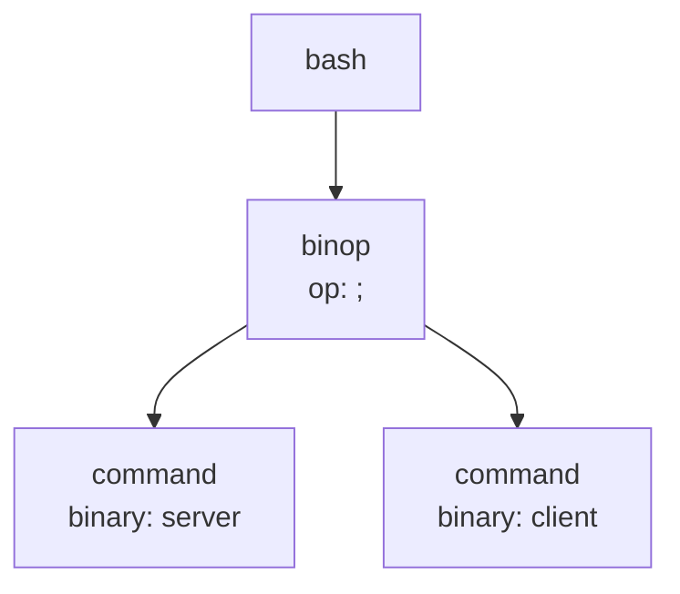

# background

Command:

```sh
server & client
```

AST:


```mermaid
graph TD
  n0["bash"]
  n1["binop<br/>op: ;"]
  n2["command<br/>binary: server"]
  n1 --> n2
  n3["command<br/>binary: client"]
  n1 --> n3
  n0 --> n1
```
