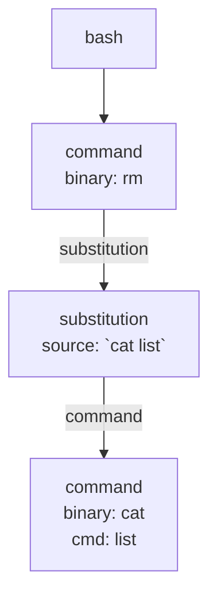

# backtick-substitution

Command:

```sh
rm `cat list`
```

AST:


```mermaid
graph TD
  n0["bash"]
  n1["command<br/>binary: rm"]
  n2["substitution<br/>source: `cat list`"]
  n3["command<br/>binary: cat<br/>cmd: list"]
  n0 --> n1
  n1 -->|substitution| n2
  n2 -->|command| n3
```
