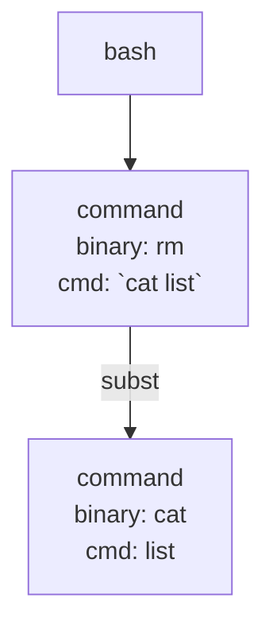

# backtick-substitution

Command:

```sh
rm `cat list`
```

AST:


```mermaid
graph TD
  n0["bash"]
  n1["command<br/>binary: rm<br/>cmd: `cat list`"]
  n2["command<br/>binary: cat<br/>cmd: list"]
  n1 -->|subst| n2
  n0 --> n1
```

## Duplicates

Same construct as:

- [bash-backtick-substitution](../bash-backtick-substitution/index.md)
