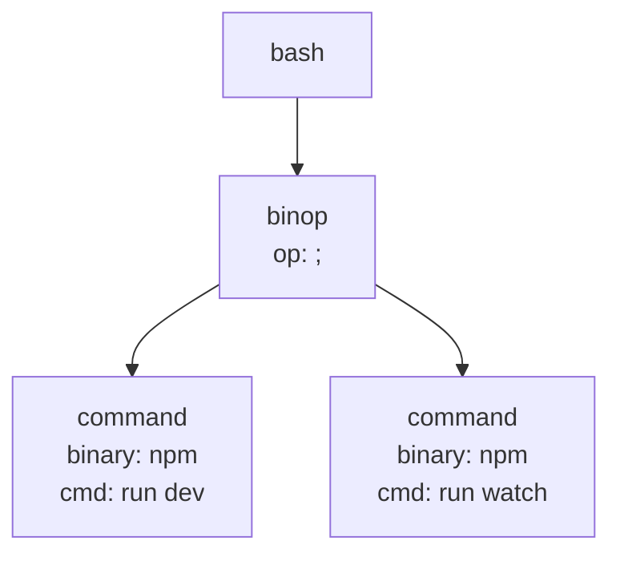

# bash-background-separator

Command:

```sh
npm run dev & npm run watch
```

AST:


```mermaid
graph TD
  n0["bash"]
  n1["binop<br/>op: ;"]
  n2["command<br/>binary: npm<br/>cmd: run dev"]
  n1 --> n2
  n3["command<br/>binary: npm<br/>cmd: run watch"]
  n1 --> n3
  n0 --> n1
```
