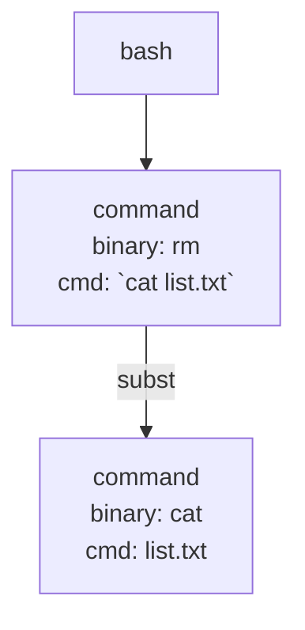

# bash-backtick-substitution

Command:

```sh
rm `cat list.txt`
```

AST:


```mermaid
graph TD
  n0["bash"]
  n1["command<br/>binary: rm<br/>cmd: `cat list.txt`"]
  n2["command<br/>binary: cat<br/>cmd: list.txt"]
  n1 -->|subst| n2
  n0 --> n1
```
