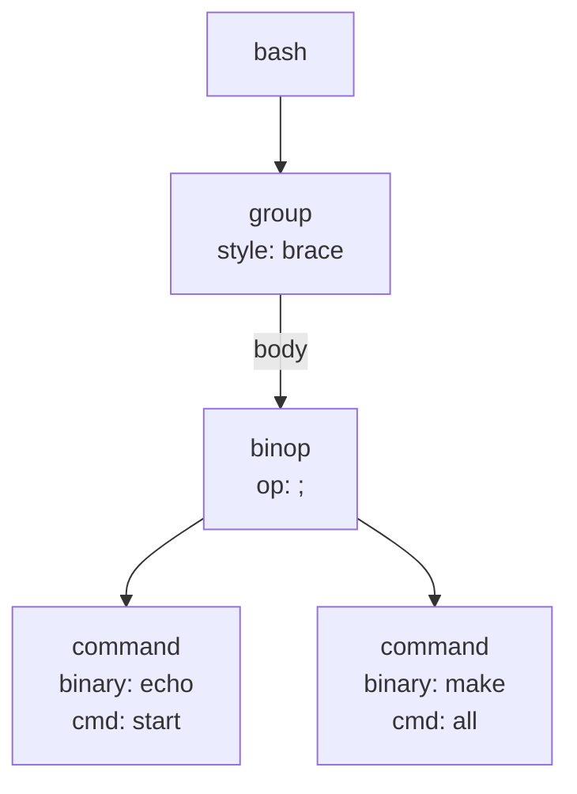

# bash-brace-group

Command:

```sh
{ echo start; make all; }
```

AST:


```mermaid
graph TD
  n0["bash"]
  n1["group<br/>style: brace"]
  n2["binop<br/>op: ;"]
  n3["command<br/>binary: echo<br/>cmd: start"]
  n2 --> n3
  n4["command<br/>binary: make<br/>cmd: all"]
  n2 --> n4
  n1 -->|body| n2
  n0 --> n1
```
