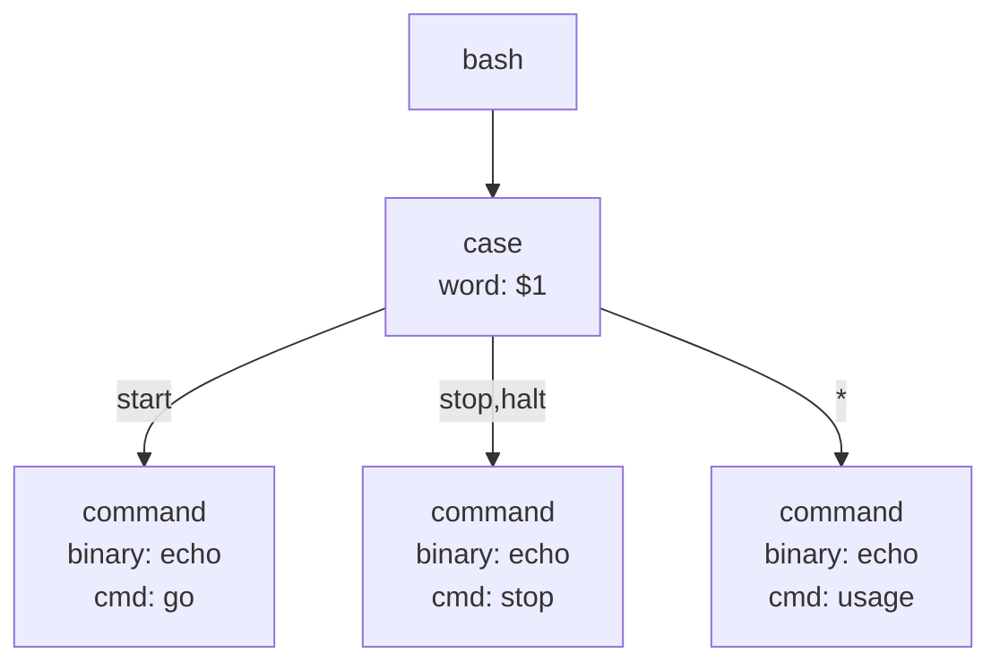

# bash-case

Command:

```sh
case $1 in start) echo go;; stop|halt) echo stop;; *) echo usage;; esac
```

AST:


```mermaid
graph TD
  n0["bash"]
  n1["case<br/>word: $1"]
  n2["command<br/>binary: echo<br/>cmd: go"]
  n1 -->|start| n2
  n3["command<br/>binary: echo<br/>cmd: stop"]
  n1 -->|stop,halt| n3
  n4["command<br/>binary: echo<br/>cmd: usage"]
  n1 -->|*| n4
  n0 --> n1
```
