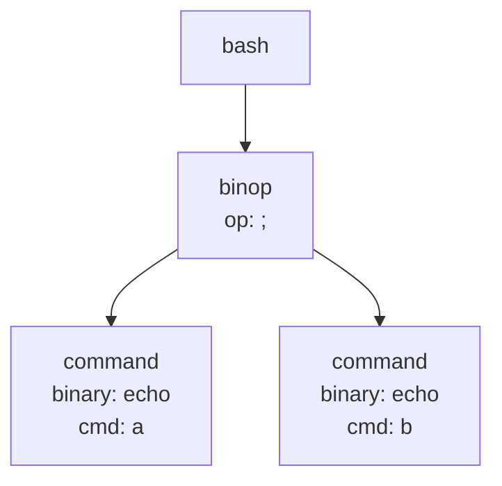

# bash-comment-line

Command:

```sh
echo a # note
echo b
```

AST:


```mermaid
graph TD
  n0["bash"]
  n1["binop<br/>op: ;"]
  n2["command<br/>binary: echo<br/>cmd: a"]
  n1 --> n2
  n3["command<br/>binary: echo<br/>cmd: b"]
  n1 --> n3
  n0 --> n1
```

## Duplicates

Same Bash command as:

- [comment-line](../comment-line/index.md)
