# bash-for-loop-kubectl

Command:

```sh
for region in ap-northwest-1 na-central-1; do echo "=== $region pods ==="; kubectl --context arn:aws:eks:$region:1234:cluster/example-cluster -n example-namespace get pods 2>&1 | grep -v Running | head -5; done
```

AST:

```mermaid
graph TD
  n0["bash"]
  n1["for_loop<br/>var: region<br/>in: ap-northwest-1 na-central-1"]
  n2["binop<br/>op: ;"]
  n3["command<br/>binary: echo<br/>cmd: === $region pods ==="]
  n2 --> n3
  n4["binop<br/>op: &#124;"]
  n5["binop<br/>op: &#124;"]
  n6["redirect<br/>op: 2&gt;&amp;<br/>target: 1"]
  n7["command<br/>binary: kubectl<br/>cmd: get pods"]
  n6 -->|command| n7
  n5 --> n6
  n8["command<br/>binary: grep"]
  n5 --> n8
  n4 --> n5
  n9["command<br/>binary: head"]
  n4 --> n9
  n2 --> n4
  n1 -->|body| n2
  n0 --> n1
```


