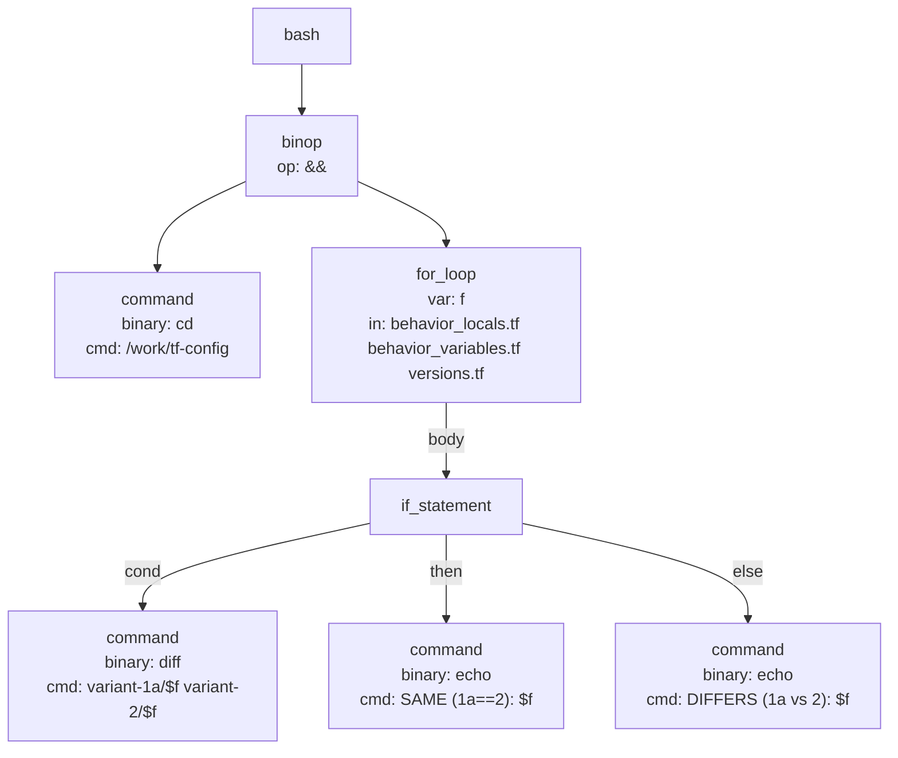

# bash-if-in-for-loop

Command:

```sh
cd /work/tf-config && for f in behavior_locals.tf behavior_variables.tf versions.tf; do if diff -q variant-1a/$f variant-2/$f >/dev/null 2>&1; then echo "SAME (1a==2): $f"; else echo "DIFFERS (1a vs 2): $f"; fi; done
```

AST:


