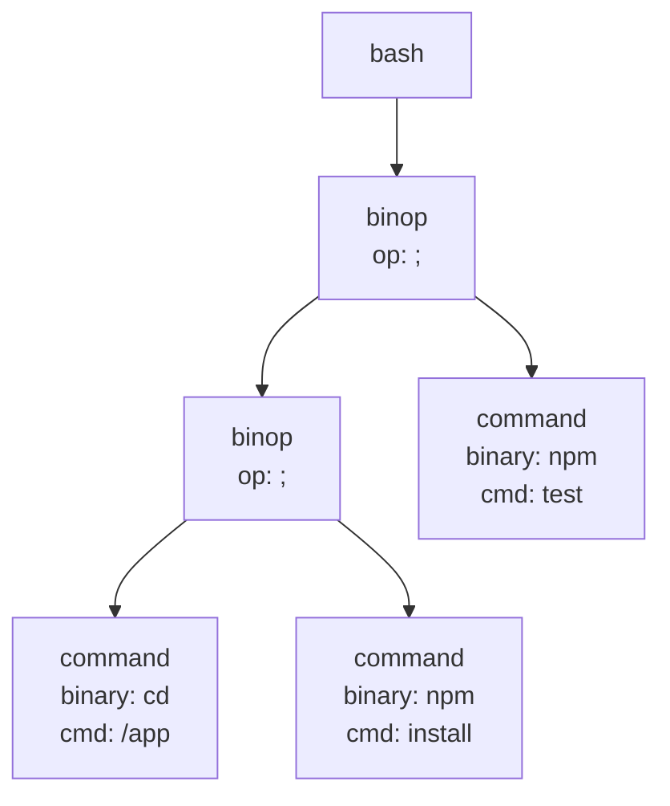

# bash-newline-separator

Command:

```sh
cd /app
npm install
npm test
```

AST:


```mermaid
graph TD
  n0["bash"]
  n1["binop<br/>op: ;"]
  n2["binop<br/>op: ;"]
  n3["command<br/>binary: cd<br/>cmd: /app"]
  n2 --> n3
  n4["command<br/>binary: npm<br/>cmd: install"]
  n2 --> n4
  n1 --> n2
  n5["command<br/>binary: npm<br/>cmd: test"]
  n1 --> n5
  n0 --> n1
```
