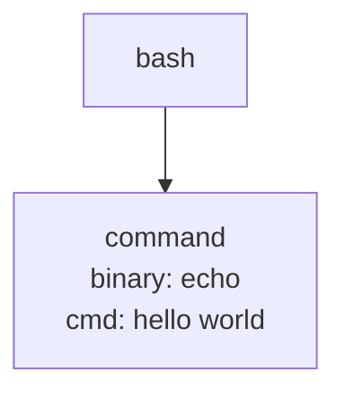

# bash-quoted-arg

Command:

```sh
echo "hello world"
```

AST:


```mermaid
graph TD
  n0["bash"]
  n1["command<br/>binary: echo<br/>cmd: hello world"]
  n0 --> n1
```

## Duplicates

Same Bash command as:

- [quoted-arg](../quoted-arg/index.md)
