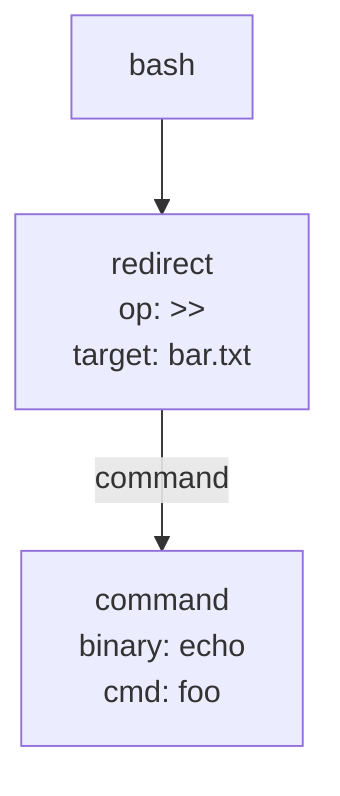

# bash-redirect-append

Command:

```sh
echo foo >> bar.txt
```

AST:


```mermaid
graph TD
  n0["bash"]
  n1["redirect<br/>op: &gt;&gt;<br/>target: bar.txt"]
  n2["command<br/>binary: echo<br/>cmd: foo"]
  n1 -->|command| n2
  n0 --> n1
```

## Duplicates

Same Bash command as:

- [redirect-append](../redirect-append/index.md)
