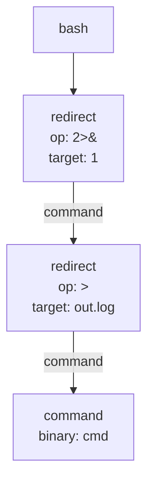

# bash-redirect-fd-merge

Command:

```sh
cmd > out.log 2>&1
```

AST:


```mermaid
graph TD
  n0["bash"]
  n1["redirect<br/>op: 2&gt;&amp;<br/>target: 1"]
  n2["redirect<br/>op: &gt;<br/>target: out.log"]
  n3["command<br/>binary: cmd"]
  n2 -->|command| n3
  n1 -->|command| n2
  n0 --> n1
```

## Duplicates

Same Bash command as:

- [redirect-fd-merge](../redirect-fd-merge/index.md)
