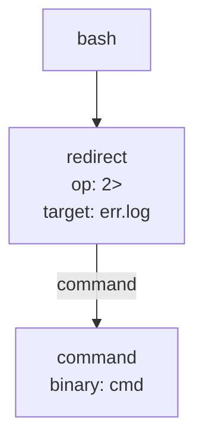

# bash-redirect-stderr

Command:

```sh
cmd 2> err.log
```

AST:


```mermaid
graph TD
  n0["bash"]
  n1["redirect<br/>op: 2&gt;<br/>target: err.log"]
  n2["command<br/>binary: cmd"]
  n1 -->|command| n2
  n0 --> n1
```
