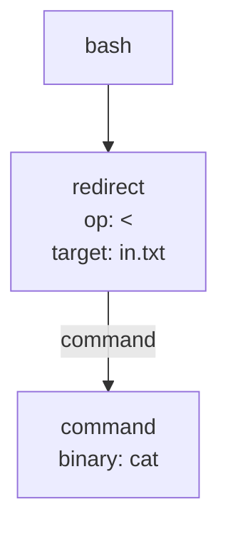

# bash-redirect-stdin

Command:

```sh
cat < in.txt
```

AST:


```mermaid
graph TD
  n0["bash"]
  n1["redirect<br/>op: &lt;<br/>target: in.txt"]
  n2["command<br/>binary: cat"]
  n1 -->|command| n2
  n0 --> n1
```

## Duplicates

Same Bash command as:

- [redirect-stdin](../redirect-stdin/index.md)
