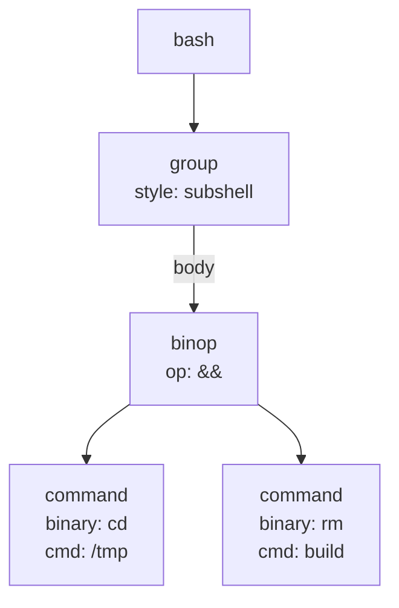

# bash-subshell-group

Command:

```sh
(cd /tmp && rm -rf build)
```

AST:


```mermaid
graph TD
  n0["bash"]
  n1["group<br/>style: subshell"]
  n2["binop<br/>op: &amp;&amp;"]
  n3["command<br/>binary: cd<br/>cmd: /tmp"]
  n2 --> n3
  n4["command<br/>binary: rm<br/>cmd: build"]
  n2 --> n4
  n1 -->|body| n2
  n0 --> n1
```
