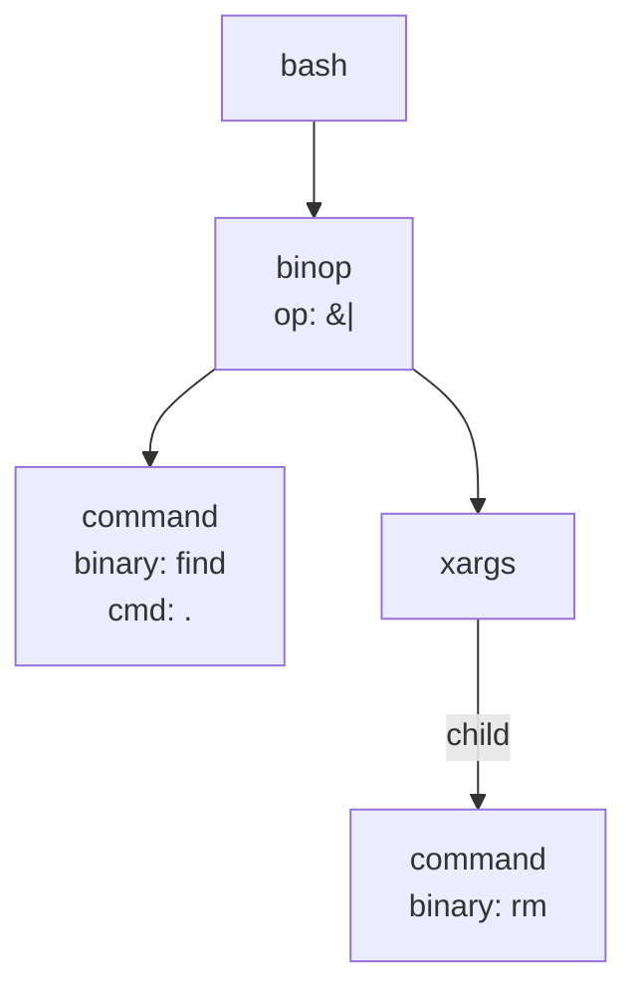

# bash-xargs

Command:

```sh
find . | xargs rm -rf
```

AST:


```mermaid
graph TD
  n0["bash"]
  n1["binop<br/>op: &#124;"]
  n2["command<br/>binary: find<br/>cmd: ."]
  n1 --> n2
  n3["xargs"]
  n4["command<br/>binary: rm"]
  n3 -->|child| n4
  n1 --> n3
  n0 --> n1
```
