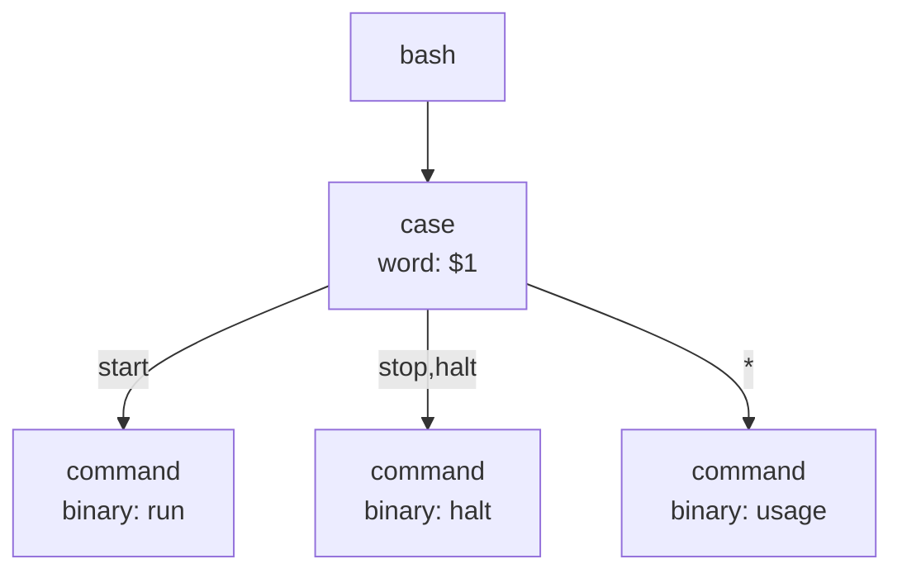

# case

Command:

```sh
case $1 in start) run;; stop|halt) halt;; *) usage;; esac
```

AST:


```mermaid
graph TD
  n0["bash"]
  n1["case<br/>word: $1"]
  n2["command<br/>binary: run"]
  n1 -->|start| n2
  n3["command<br/>binary: halt"]
  n1 -->|stop,halt| n3
  n4["command<br/>binary: usage"]
  n1 -->|*| n4
  n0 --> n1
```

## Duplicates

Same construct as:

- [bash-case](../bash-case/index.md)
