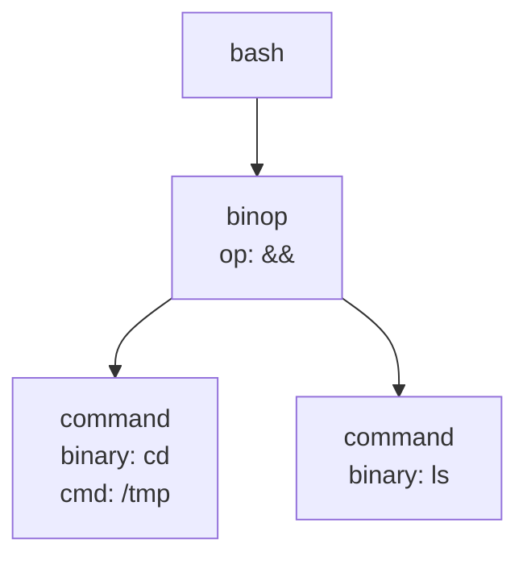

# cd

Command:

```sh
cd /tmp && ls
```

AST:


```mermaid
graph TD
  n0["bash"]
  n1["binop<br/>op: &amp;&amp;"]
  n2["command<br/>binary: cd<br/>cmd: /tmp"]
  n1 --> n2
  n3["command<br/>binary: ls"]
  n1 --> n3
  n0 --> n1
```
