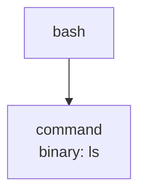

# comment-trailing

Command:

```sh
ls -la # list the directory
```

AST:


```mermaid
graph TD
  n0["bash"]
  n1["command<br/>binary: ls"]
  n0 --> n1
```

## Duplicates

Same Bash command as:

- [bash-comment-trailing](../bash-comment-trailing/index.md)
