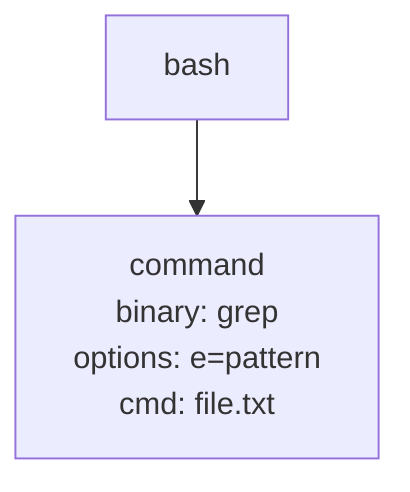

# flag-value-and-positional

Command:

```sh
grep -e pattern file.txt
```

Short flag `-e` takes the value `pattern`; `file.txt` is a positional argument.

AST:


```mermaid
graph TD
  n0["bash"]
  n1["command<br/>binary: grep<br/>options: e=pattern<br/>cmd: file.txt"]
  n0 --> n1
```
