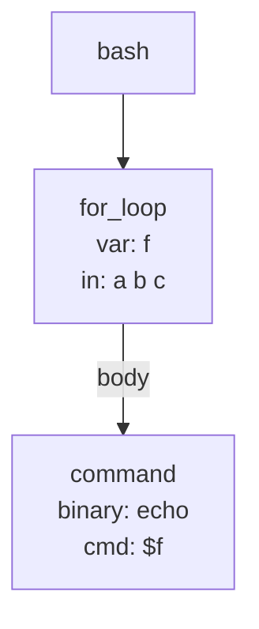

# for-loop

Command:

```sh
for f in a b c; do echo $f; done
```

AST:


```mermaid
graph TD
  n0["bash"]
  n1["for_loop<br/>var: f<br/>in: a b c"]
  n2["command<br/>binary: echo<br/>cmd: $f"]
  n1 -->|body| n2
  n0 --> n1
```

## Duplicates

Same construct as:

- [bash-for-loop-kubectl](../bash-for-loop-kubectl/index.md)
