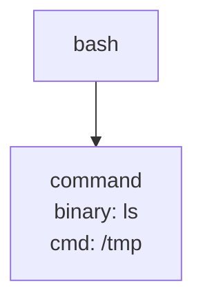

# ls-flags

Command:

```sh
ls -la /tmp
```

AST:


```mermaid
graph TD
  n0["bash"]
  n1["command<br/>binary: ls<br/>cmd: /tmp"]
  n0 --> n1
```

## Duplicates

Same Bash command as:

- [bash-simple-ls](../bash-simple-ls/index.md)
