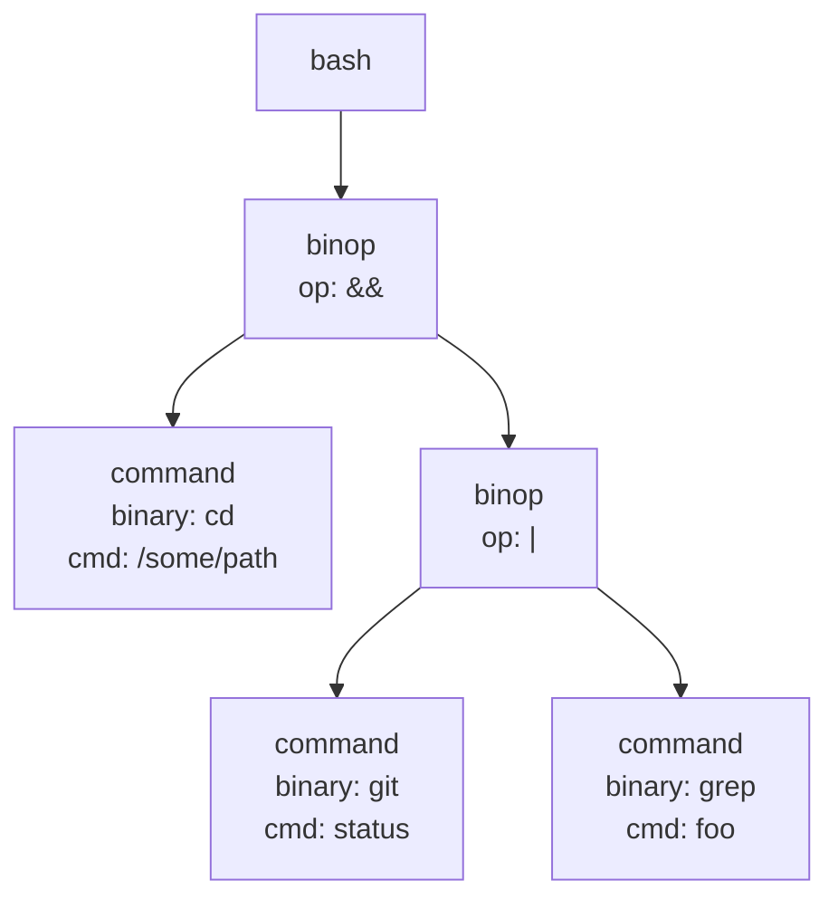

# nested-and-pipe

Command:

```sh
cd /some/path && git status | grep foo
```

AST:


```mermaid
graph TD
  n0["bash"]
  n1["binop<br/>op: &amp;&amp;"]
  n2["command<br/>binary: cd<br/>cmd: /some/path"]
  n1 --> n2
  n3["binop<br/>op: |"]
  n4["command<br/>binary: git<br/>cmd: status"]
  n3 --> n4
  n5["command<br/>binary: grep<br/>cmd: foo"]
  n3 --> n5
  n1 --> n3
  n0 --> n1
```
