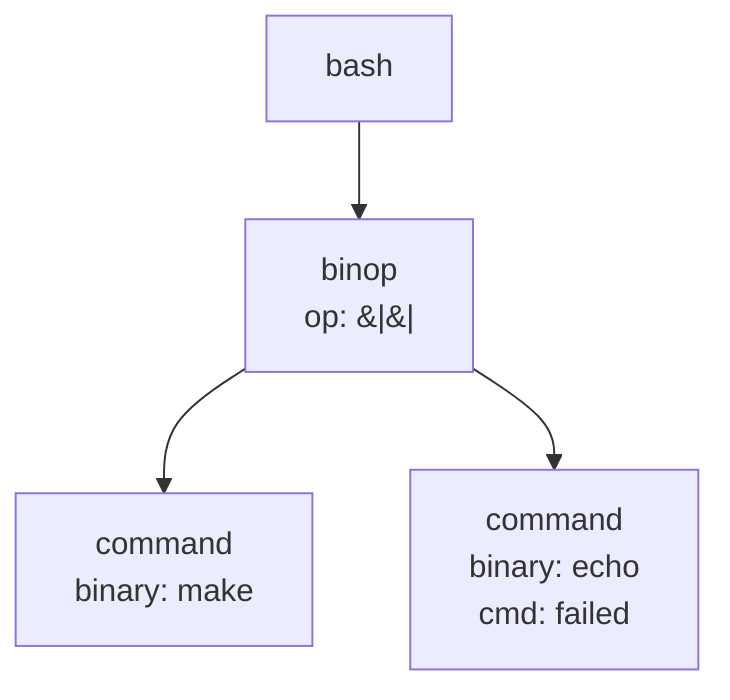

# or-operator

Command:

```sh
make || echo failed
```

AST:


```mermaid
graph TD
  n0["bash"]
  n1["binop<br/>op: &#124;&#124;"]
  n2["command<br/>binary: make"]
  n1 --> n2
  n3["command<br/>binary: echo<br/>cmd: failed"]
  n1 --> n3
  n0 --> n1
```

## Duplicates

Same construct as:

- [bash-or](../bash-or/index.md)
