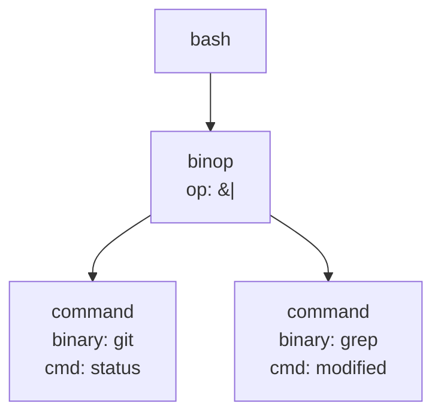

# pipe

Command:

```sh
git status | grep modified
```

AST:


```mermaid
graph TD
  n0["bash"]
  n1["binop<br/>op: &#124;"]
  n2["command<br/>binary: git<br/>cmd: status"]
  n1 --> n2
  n3["command<br/>binary: grep<br/>cmd: modified"]
  n1 --> n3
  n0 --> n1
```

## Duplicates

Same Bash command as:

- [bash-pipe](../bash-pipe/index.md)
