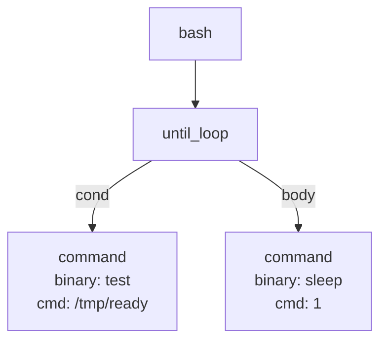

# until-loop

Command:

```sh
until test -f /tmp/ready; do sleep 1; done
```

AST:


```mermaid
graph TD
  n0["bash"]
  n1["until_loop"]
  n2["command<br/>binary: test<br/>cmd: /tmp/ready"]
  n1 -->|cond| n2
  n3["command<br/>binary: sleep<br/>cmd: 1"]
  n1 -->|body| n3
  n0 --> n1
```
