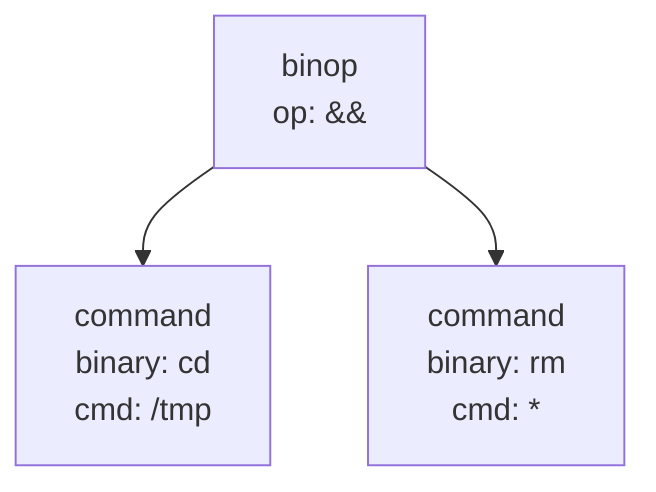

# and-operator

Command:

```sh
cd /tmp && rm -rf *
```

AST:


```mermaid
graph TD
  n0["binop<br/>op: &amp;&amp;"]
  n1["command<br/>binary: cd<br/>cmd: /tmp"]
  n0 --> n1
  n2["command<br/>binary: rm<br/>cmd: *"]
  n0 --> n2
```
