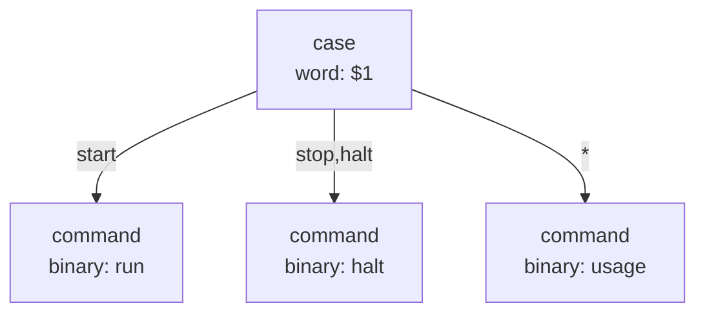

# case

Command:

```sh
case $1 in start) run;; stop|halt) halt;; *) usage;; esac
```

AST:


```mermaid
graph TD
  n0["case<br/>word: $1"]
  n1["command<br/>binary: run"]
  n0 -->|start| n1
  n2["command<br/>binary: halt"]
  n0 -->|stop,halt| n2
  n3["command<br/>binary: usage"]
  n0 -->|*| n3
```
