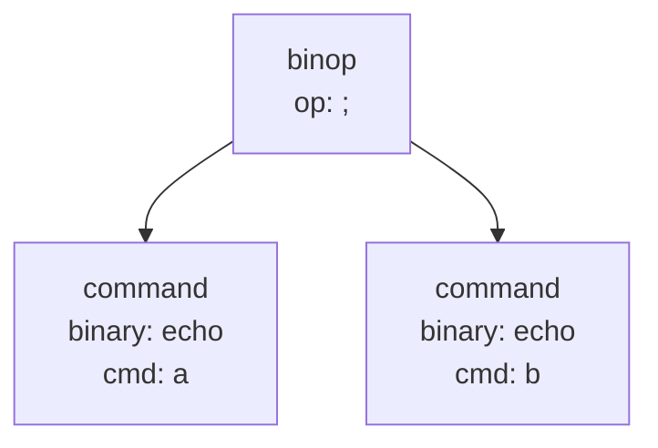

# comment-line

Command:

```sh
echo a # note
echo b
```

AST:


```mermaid
graph TD
  n0["binop<br/>op: ;"]
  n1["command<br/>binary: echo<br/>cmd: a"]
  n0 --> n1
  n2["command<br/>binary: echo<br/>cmd: b"]
  n0 --> n2
```
