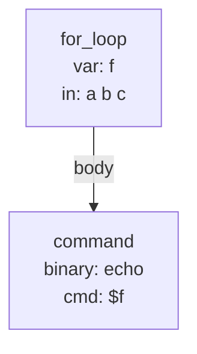

# for-loop

Command:

```sh
for f in a b c; do echo $f; done
```

AST:


```mermaid
graph TD
  n0["for_loop<br/>var: f<br/>in: a b c"]
  n1["command<br/>binary: echo<br/>cmd: $f"]
  n0 -->|body| n1
```
