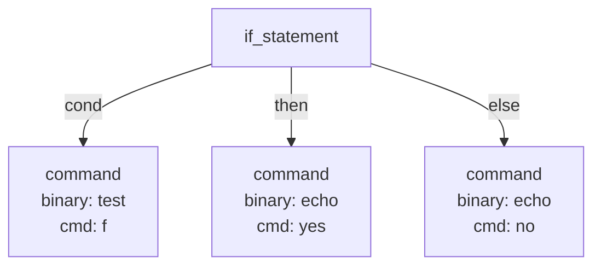

# if-statement

Command:

```sh
if test -f f; then echo yes; else echo no; fi
```

AST:


```mermaid
graph TD
  n0["if_statement"]
  n1["command<br/>binary: test<br/>cmd: f"]
  n0 -->|cond| n1
  n2["command<br/>binary: echo<br/>cmd: yes"]
  n0 -->|then| n2
  n3["command<br/>binary: echo<br/>cmd: no"]
  n0 -->|else| n3
```
