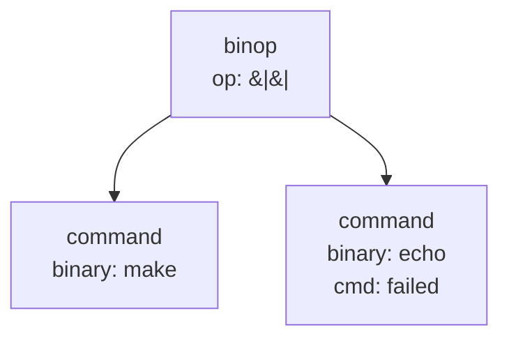

# or-operator

Command:

```sh
make || echo failed
```

AST:


```mermaid
graph TD
  n0["binop<br/>op: &#124;&#124;"]
  n1["command<br/>binary: make"]
  n0 --> n1
  n2["command<br/>binary: echo<br/>cmd: failed"]
  n0 --> n2
```
