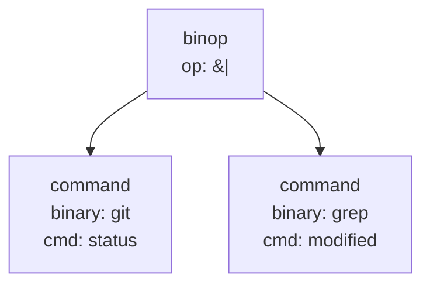

# pipe

Command:

```sh
git status | grep modified
```

AST:


```mermaid
graph TD
  n0["binop<br/>op: &#124;"]
  n1["command<br/>binary: git<br/>cmd: status"]
  n0 --> n1
  n2["command<br/>binary: grep<br/>cmd: modified"]
  n0 --> n2
```
