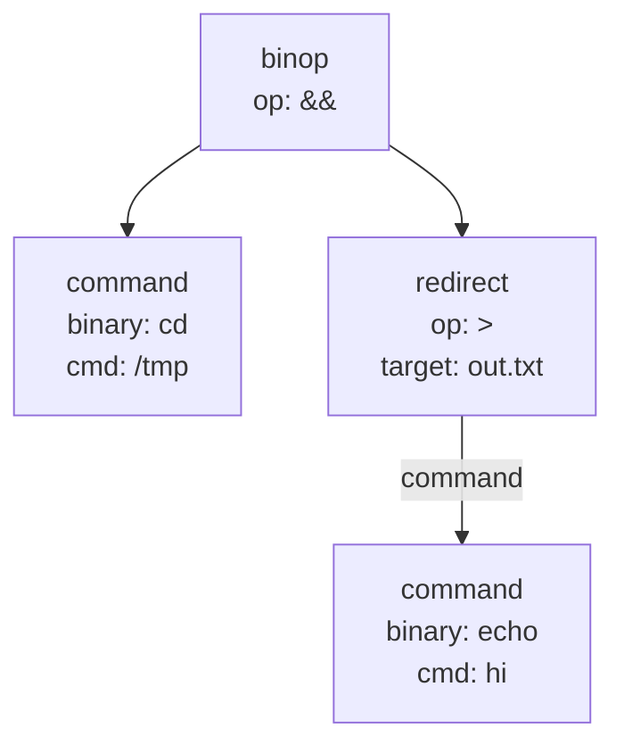

# redirect-and-binop

Command:

```sh
cd /tmp && echo hi > out.txt
```

AST:


```mermaid
graph TD
  n0["binop<br/>op: &amp;&amp;"]
  n1["command<br/>binary: cd<br/>cmd: /tmp"]
  n0 --> n1
  n2["redirect<br/>op: &gt;<br/>target: out.txt"]
  n3["command<br/>binary: echo<br/>cmd: hi"]
  n2 -->|command| n3
  n0 --> n2
```
