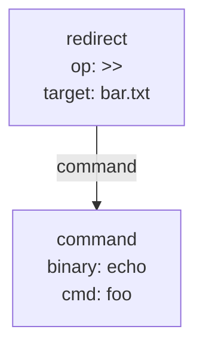

# redirect-append

Command:

```sh
echo foo >> bar.txt
```

AST:


```mermaid
graph TD
  n0["redirect<br/>op: &gt;&gt;<br/>target: bar.txt"]
  n1["command<br/>binary: echo<br/>cmd: foo"]
  n0 -->|command| n1
```
