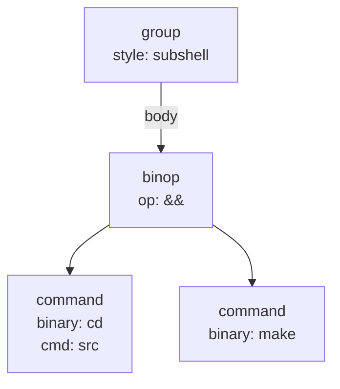

# subshell

Command:

```sh
(cd src && make)
```

AST:


```mermaid
graph TD
  n0["group<br/>style: subshell"]
  n1["binop<br/>op: &amp;&amp;"]
  n2["command<br/>binary: cd<br/>cmd: src"]
  n1 --> n2
  n3["command<br/>binary: make"]
  n1 --> n3
  n0 -->|body| n1
```
