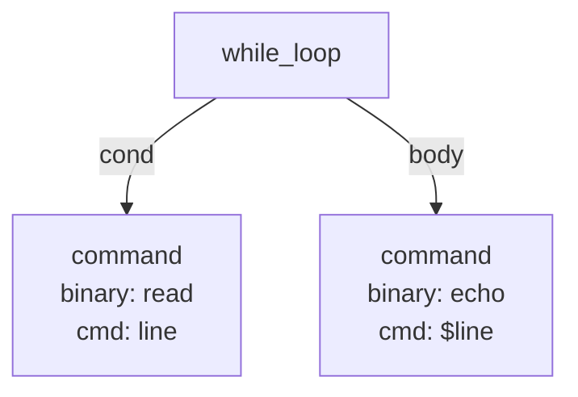

# while-loop

Command:

```sh
while read line; do echo $line; done
```

AST:


```mermaid
graph TD
  n0["while_loop"]
  n1["command<br/>binary: read<br/>cmd: line"]
  n0 -->|cond| n1
  n2["command<br/>binary: echo<br/>cmd: $line"]
  n0 -->|body| n2
```
