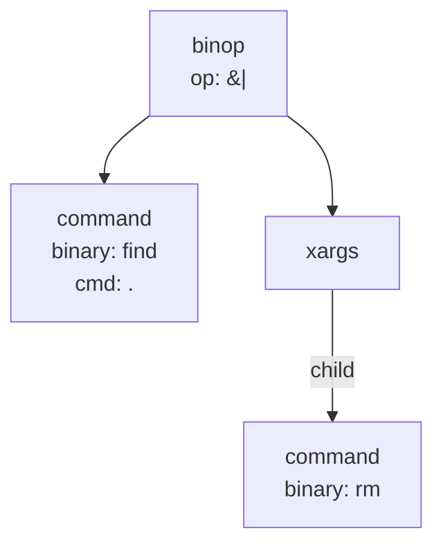

# xargs

Command:

```sh
find . | xargs rm
```

AST:


```mermaid
graph TD
  n0["binop<br/>op: &#124;"]
  n1["command<br/>binary: find<br/>cmd: ."]
  n0 --> n1
  n2["xargs"]
  n3["command<br/>binary: rm"]
  n2 -->|child| n3
  n0 --> n2
```
